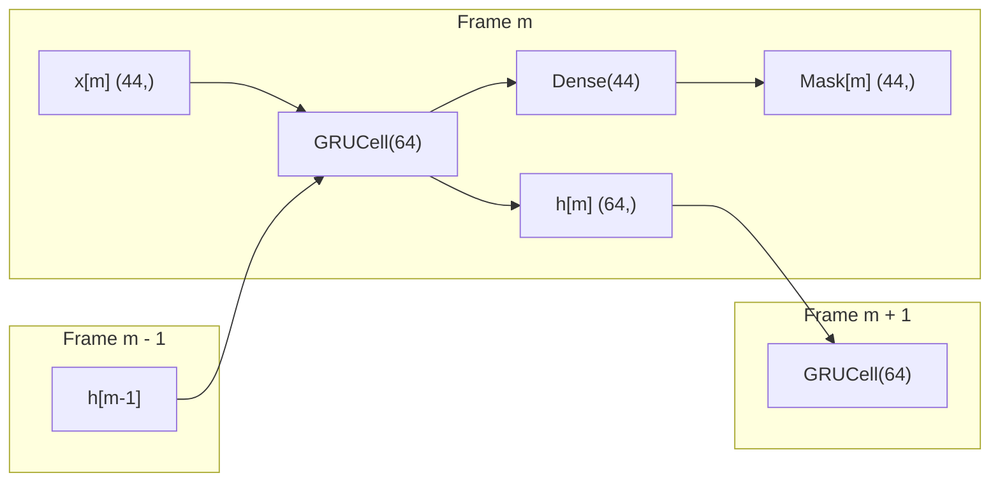

# ImpulseGuard Developer Technical Reference (`DOCS.md`)

This document serves as the comprehensive, ground-truth developer and engineering reference manual for **ImpulseGuard**, an edge-AI speech enhancement system designed for harsh, impulsive, and drone-dominated acoustic environments.

---

## 1. Project Configuration

All global audio processing, feature extraction, neural network dimensions, and hardware parameters are centrally managed across the Python codebase and ESP32-S3 firmware.

### 1.1 Python Core DSP & Model Parameters (`src/config.py`)

| Parameter Name | Type | Default Value | Physical Unit | Description | Constraints / Valid Range | Impact if Changed |
| :--- | :--- | :--- | :--- | :--- | :--- | :--- |
| `SAMPLE_RATE` | `int` | `16000` | Hz | Global audio sampling rate. | Must be `16000` (fixed by filterbank, dataset, and acoustic model). | Changing requires resampling entire dataset, recomputing Bark filterbank centers, and retraining model. |
| `FRAME_SIZE` | `int` | `320` | Samples | STFT analysis frame length ($20.0\text{ ms}$). | Must be an even positive integer; typically $2 \times \text{HOP\_SIZE}$. | Alters temporal resolution. Affects STFT frequency bin count and windowing. |
| `HOP_SIZE` | `int` | `160` | Samples | STFT frame advance / hop length ($10.0\text{ ms}$). | Must equal $160$ for $50\%$ overlap at $F_s = 16\text{ kHz}$. | Defines the real-time processing deadline ($10.0\text{ ms}$). Increasing increases algorithmic latency; decreasing reduces processing budget. |
| `FFT_SIZE` | `int` | `512` | Points | Radix-2 Fast Fourier Transform size. | Power of 2, must be $\ge \text{FRAME\_SIZE}$ (zero-padded from $320$). | Changing alters frequency resolution ($\Delta f = F_s / N$) and modifies the bin count. |
| `NUM_FREQ_BINS` | `int` | `257` | Bins | Positive frequency bins: $\frac{N_{\text{FFT}}}{2} + 1$. | Strictly determined by $512 / 2 + 1 = 257$. | Impacts filterbank mapping matrix shape $(22 \times 257)$ and STFT/ISTFT buffers. |
| `NUM_SUBBANDS` | `int` | `22` | Bands | Number of Bark-scale psychoacoustic triangular subbands. | $10 \le K \le 32$. Set to $22$ to span $0 \text{ Hz}$ to $8 \text{ kHz}$. | Modifies feature vector size ($2K$) and neural network input/output dimensions. |
| `NUM_FEATURES` | `int` | `44` | Dimensions | Input feature vector per frame: $22\text{ log Bark energies} + 22\text{ delta energies}$. | Strictly $2 \times \text{NUM\_SUBBANDS}$. | Changes neural network input layer dimension. Requires model retraining. |
| `NUM_TARGETS` | `int` | `44` | Dimensions | Neural network output mask: $22\text{ real} + 22\text{ imaginary}$ cIRM values. | Strictly $2 \times \text{NUM\_SUBBANDS}$. | Changes Dense output layer dimension. Requires model retraining. |
| `MASK_MAGNITUDE_MAX`| `float`| `2.0` | Dimensionless | Maximum allowable complex mask gain $|M_k(m)|$. | Real scalar $> 0.0$. | Prevents unbounded amplification during low-energy noisy speech segments. |

---

### 1.2 Firmware Hardware & DSP Configuration (`firmware/esp32_impulse_guard/`)

| Parameter Name | File Location | Type | Default Value | Physical Unit | Description & Hardware Pin | Constraints / Notes |
| :--- | :--- | :--- | :--- | :--- | :--- | :--- |
| `SHARED_BCLK` | `esp32_impulse_guard.ino` | Macro (`int`) | `15` | GPIO | Shared I2S Bit Clock pin for INMP441 and MAX98357A. | Must support standard digital output. |
| `SHARED_WS` | `esp32_impulse_guard.ino` | Macro (`int`) | `16` | GPIO | Shared I2S Word Select (LRCLK / Frame Clock). | $16\text{ kHz}$ clock signal. |
| `MIC_SD` | `esp32_impulse_guard.ino` | Macro (`int`) | `17` | GPIO | INMP441 MEMS microphone Serial Data Out (ESP32 RX). | Must support input matrix mapping. |
| `AMP_DIN` | `esp32_impulse_guard.ino` | Macro (`int`) | `5` | GPIO | MAX98357A Class-D amplifier Serial Data In (ESP32 TX). | Must support output matrix mapping. |
| `VOLUME_GAIN` | `esp32_impulse_guard.ino` | Macro (`float`)| `1.0` | Linear Scale | Digital output multiplier applied to reconstructed PCM samples. | Clamped to $[-32768, 32767]$ int16 saturation limits. |
| `RECORD_SECONDS` | `esp32_impulse_guard.ino` | Macro (`int`) | `5` | Seconds | Demo loop recording and enhancement duration. | Total samples = $5 \times 16000 = 80000$. |
| `PAUSE_SECONDS` | `esp32_impulse_guard.ino` | Macro (`int`) | `2` | Seconds | Silent pause interval between recording and playback. | TX remains active transmitting digital silence. |
| `kTensorArenaSize` | `src/gru_inference.cpp` | `constexpr int`| `204800` | Bytes | TFLite Micro activation and scratch buffer ($200\text{ KB}$). | Allocated dynamically in Octal-SPI PSRAM via `ps_malloc()`. |
| `GRU_INPUT_SIZE` | `src/gru_inference.h` | `constexpr int`| `44` | Elements | Number of normalized Bark features per inference step. | Matches INT8 model input tensor `[1, 44]`. |
| `GRU_HIDDEN_SIZE` | `src/gru_inference.h` | `constexpr int`| `64` | Elements | Recurrent hidden state vector dimension. | Matches INT8 recurrent state tensor `[1, 64]`. |
| `GRU_OUTPUT_SIZE` | `src/gru_inference.h` | `constexpr int`| `44` | Elements | Number of complex mask coefficients ($22\text{ real} + 22\text{ imag}$). | Matches INT8 mask output tensor `[1, 44]`. |

---

## 2. File-by-File API Reference

### 2.1 Python Modules (`src/`)

#### [`src/config.py`](file:///home/agniva/impuse-guard/src/config.py)
* **Purpose**: Defines global constants and hyperparameters for sampling rate, framing, STFT windowing, Bark filterbank resolution, and neural network input/output shapes.
* **Constants Exported**: `SAMPLE_RATE` (16000), `FRAME_SIZE` (320), `HOP_SIZE` (160), `FFT_SIZE` (512), `NUM_FREQ_BINS` (257), `NUM_SUBBANDS` (22), `NUM_FEATURES` (44), `NUM_TARGETS` (44), `MASK_MAGNITUDE_MAX` (2.0).

---

#### [`src/stft.py`](file:///home/agniva/impuse-guard/src/stft.py)
* **Purpose**: Computes forward Short-Time Fourier Transform (STFT) using causal, non-centered Hann windowing.
* **Functions**:
  * `compute_stft(audio: np.ndarray, frame_size: int = 320, hop_size: int = 160, fft_size: int = 512) -> np.ndarray`:
    * *Arguments*:
      * `audio`: 1D NumPy array (`float32`), audio waveform.
      * `frame_size`: Window length in samples (default 320).
      * `hop_size`: Hop advance in samples (default 160).
      * `fft_size`: FFT points (default 512, zero-padded).
    * *Returns*: Complex STFT matrix of shape `(257, num_frames)` with `dtype=complex64`.
    * *Algorithm*: Slices input into frames of 320 samples, multiplies by periodic Hann window $w[n] = 0.5 - 0.5\cos(2\pi n / 320)$, zero-pads to 512 samples, and evaluates `np.fft.rfft()`.
  * `stft_to_magnitude_phase(stft_matrix: np.ndarray) -> Tuple[np.ndarray, np.ndarray]`:
    * *Arguments*: `stft_matrix`: Complex array of shape `(257, num_frames)`.
    * *Returns*: `(magnitude, phase)` where magnitude is `np.abs(stft_matrix)` and phase is `np.angle(stft_matrix)`.

---

#### [`src/istft.py`](file:///home/agniva/impuse-guard/src/istft.py)
* **Purpose**: Reconstructs time-domain audio waveforms from complex STFT matrices via overlap-add Inverse Short-Time Fourier Transform.
* **Functions**:
  * `compute_istft(stft_matrix: np.ndarray, frame_size: int = 320, hop_size: int = 160, fft_size: int = 512, length: Optional[int] = None) -> np.ndarray`:
    * *Arguments*:
      * `stft_matrix`: Complex array of shape `(257, num_frames)`.
      * `frame_size`: Window size (320).
      * `hop_size`: Overlap advance (160).
      * `fft_size`: IFFT length (512).
      * `length`: Optional target output waveform length in samples.
    * *Returns*: 1D NumPy array (`float32`) containing synthesized audio.
    * *Algorithm*: Evaluates `np.fft.irfft()` on each column, truncates each frame to 320 samples, multiplies by synthesis Hann window, and accumulates into the output buffer with overlap-add normalization $\sum_m w^2[n - mH] = 1.0$.

---

#### [`src/subbands.py`](file:///home/agniva/impuse-guard/src/subbands.py)
* **Purpose**: Generates Bark-scale triangular filterbanks, extracts subband log energies, and computes first-order temporal delta features.
* **Functions**:
  * `get_bark_band_centers() -> np.ndarray`:
    * *Returns*: 1D array of 22 center frequencies in Hz spanning $50\text{ Hz}$ to $7000\text{ Hz}$.
  * `compute_bark_filterbank(num_bins: int = 257, sample_rate: int = 16000, num_bands: int = 22) -> np.ndarray`:
    * *Returns*: Triangular filterbank weight matrix $W \in \mathbb{R}^{22 \times 257}$ normalized such that each band sums to 1.0.
  * `compute_subband_energies(stft_matrix: np.ndarray, filterbank: np.ndarray) -> np.ndarray`:
    * *Arguments*: `stft_matrix` `(257, T)`, `filterbank` `(22, 257)`.
    * *Returns*: Log subband energy matrix $E \in \mathbb{R}^{T \times 22}$, computed as $\log_{10}(W \cdot |X|^2 + 10^{-12})$.
  * `compute_delta_energies(log_energies: np.ndarray) -> np.ndarray`:
    * *Arguments*: `log_energies` `(T, 22)`.
    * *Returns*: Delta energies $\Delta E \in \mathbb{R}^{T \times 22}$, where $\Delta E(m) = E(m) - E(m-1)$ with $\Delta E(0) = 0$.
  * `extract_subband_features(stft_matrix: np.ndarray) -> np.ndarray`:
    * *Returns*: Concatenated feature matrix `(T, 44)` combining 22 log energies and 22 delta energies.

---

#### [`src/feature_normalization.py`](file:///home/agniva/impuse-guard/src/feature_normalization.py)
* **Purpose**: Calculates running dataset statistics, normalizes feature vectors to zero mean and unit variance, and persists statistics to JSON.
* **Functions**:
  * `calculate_statistics(features: np.ndarray) -> Tuple[np.ndarray, np.ndarray]`:
    * *Arguments*: `features` array of shape `(N, 44)`.
    * *Returns*: `(mean, std)` both of shape `(44,)`, with `std` clamped to a minimum of $10^{-8}$.
  * `normalize_features(features: np.ndarray, mean: np.ndarray, std: np.ndarray) -> np.ndarray`:
    * *Returns*: Standardized features $(features - mean) / std$ as `float32`.
  * `save_statistics(mean: np.ndarray, std: np.ndarray, output_path: str) -> None`:
    * *Description*: Serializes mean and standard deviation vectors to JSON format.
  * `load_statistics(input_path: str) -> Tuple[np.ndarray, np.ndarray]`:
    * *Returns*: Loaded `(mean, std)` arrays of shape `(44,)`.

---

#### [`src/target_mask.py`](file:///home/agniva/impuse-guard/src/target_mask.py)
* **Purpose**: Generates ground-truth subband Complex Ideal Ratio Mask (cIRM) targets from clean and noisy speech STFT representations.
* **Functions**:
  * `compute_subband_complex_mask(clean_stft: np.ndarray, noisy_stft: np.ndarray, filterbank: np.ndarray, max_gain: float = 2.0) -> Tuple[np.ndarray, np.ndarray]`:
    * *Arguments*: `clean_stft` `(257, T)`, `noisy_stft` `(257, T)`, `filterbank` `(22, 257)`, `max_gain` (2.0).
    * *Returns*: `(mask_real, mask_imag)` each of shape `(T, 22)`.
    * *Formula*:
      $$M_k(m) = \frac{\sum_f W_{k,f} (S_r Y_r + S_i Y_i)}{\sum_f W_{k,f} (Y_r^2 + Y_i^2) + \epsilon} + j \frac{\sum_f W_{k,f} (S_i Y_r - S_r Y_i)}{\sum_f W_{k,f} (Y_r^2 + Y_i^2) + \epsilon}$$
      Clamped such that $|M_k(m)| \le 2.0$.
  * `create_subband_complex_target(clean_stft: np.ndarray, noisy_stft: np.ndarray) -> np.ndarray`:
    * *Returns*: Combined target matrix of shape `(T, 44)` containing 22 real coefficients followed by 22 imaginary coefficients.

---

#### [`src/mask.py`](file:///home/agniva/impuse-guard/src/mask.py)
* **Purpose**: Post-processes neural network mask predictions, interpolates 22 subbands to 257 frequency bins, and applies complex multiplication to noisy spectra.
* **Functions**:
  * `split_gru_mask(gru_output: np.ndarray) -> Tuple[np.ndarray, np.ndarray]`:
    * *Arguments*: `gru_output` of shape `(T, 44)` or `(44,)`.
    * *Returns*: `(mask_real, mask_imag)` split into 22 real and 22 imaginary values.
  * `expand_subband_mask(subband_mask_real: np.ndarray, subband_mask_imag: np.ndarray, num_bins: int = 257) -> Tuple[np.ndarray, np.ndarray]`:
    * *Returns*: Full-spectrum mask `(bin_mask_real, bin_mask_imag)` expanded across 257 bins via 1D linear interpolation over Bark center frequencies.
  * `apply_complex_mask(noisy_stft: np.ndarray, mask_real: np.ndarray, mask_imag: np.ndarray) -> np.ndarray`:
    * *Returns*: Enhanced complex STFT matrix: $\hat{S} = (Y_r M_r - Y_i M_i) + j (Y_r M_i + Y_i M_r)$.

---

#### [`src/model.py`](file:///home/agniva/impuse-guard/src/model.py)
* **Purpose**: Constructs and compiles the non-causal/causal sequence-to-sequence Keras GRU architecture.
* **Functions**:
  * `create_gru_model(input_shape: Tuple[Optional[int], int] = (None, 44), hidden_units: int = 64, output_dim: int = 44) -> tf.keras.Model`:
    * *Layer Architecture*:
      1. `Input(shape=(None, 44), name="subband_features")`
      2. `GRU(64, return_sequences=True, activation="tanh", recurrent_activation="sigmoid", name="gru")`
      3. `Dense(44, activation="linear", name="dense")`
    * *Total Parameters*: 23,980 ($93.67\text{ KB}$ in FP32).

---

#### [`src/dataset_loader.py`](file:///home/agniva/impuse-guard/src/dataset_loader.py)
* **Purpose**: Streams precomputed clean/noisy mixture pairs from disk, executes real-time STFT and feature extraction, and feeds batched tensors to Keras.
* **Classes**:
  * `ImpulseGuardSequence(tf.keras.utils.Sequence)`:
    * *Methods*:
      * `__init__(split: str, batch_size: int = 8, shuffle: bool = True)`
      * `__len__() -> int`: Number of batches per epoch.
      * `__getitem__(index: int) -> Tuple[np.ndarray, np.ndarray]`: Returns batch of `features` `(8, T, 44)` and `targets` `(8, T, 44)`.
      * `on_epoch_end() -> None`: Shuffles dataset pair order.
* **Helper Functions**:
  * `get_split_directories(split: str) -> Tuple[Path, Path]`
  * `get_mixture_pairs(split: str) -> List[Tuple[Path, Path]]`
  * `load_audio(path: Path) -> np.ndarray`
  * `validate_audio_pair(clean: np.ndarray, noisy: np.ndarray, clean_path: Path, noisy_path: Path) -> None`
  * `create_training_sequence(batch_size: int = 8, shuffle: bool = True) -> ImpulseGuardSequence`
  * `create_validation_sequence(batch_size: int = 8, shuffle: bool = False) -> ImpulseGuardSequence`
  * `create_test_sequence(batch_size: int = 1, shuffle: bool = False) -> ImpulseGuardSequence`

---

#### [`src/inference.py`](file:///home/agniva/impuse-guard/src/inference.py)
* **Purpose**: Standalone inference runner that processes offline WAV files through the complete enhancement chain.
* **Functions**:
  * `load_model(model_path: str = "models/gru_subband/best_gru_subband.keras") -> tf.keras.Model`
  * `infer_single(model: tf.keras.Model, noisy_audio: np.ndarray, feature_mean: np.ndarray, feature_std: np.ndarray) -> np.ndarray`:
    * Runs STFT $\to$ 44-feature extraction $\to$ standardization $\to$ GRU inference $\to$ mask expansion $\to$ complex masking $\to$ ISTFT.
  * `main()`: Processes all test files in `data/mixtures/test/noisy/` and outputs enhanced audio to `data/enhanced/test/`.

---

#### [`src/evaluation/metrics.py`](file:///home/agniva/impuse-guard/src/evaluation/metrics.py)
* **Purpose**: Comprehensive acoustic metric computation engine.
* **Functions**:
  * `calculate_si_snr(target: np.ndarray, estimate: np.ndarray, eps: float = 1e-8) -> float`
  * `calculate_si_sdr(target: np.ndarray, estimate: np.ndarray, eps: float = 1e-8) -> float`
  * `calculate_stoi(target: np.ndarray, estimate: np.ndarray, sr: int = 16000, extended: bool = False) -> float`
  * `calculate_pesq(target: np.ndarray, estimate: np.ndarray, sr: int = 16000) -> float`: Returns wideband PESQ score (or `NaN` if binary is missing).
  * `compute_dnsmos(noisy: np.ndarray, enhanced: np.ndarray, sr: int = 16000, onnx_model_path: Optional[str] = None) -> dict`: Evaluates SIG, BAK, and OVRL via ONNX model or dynamic spectral proxy fallback.
  * `compute_all_standard_metrics(clean: np.ndarray, noisy: np.ndarray, enhanced: np.ndarray, sr: int = 16000) -> dict`

---

#### [`src/evaluation/impulse_metrics.py`](file:///home/agniva/impuse-guard/src/evaluation/impulse_metrics.py)
* **Purpose**: Evaluates specific transient and impulsive suppression performance.
* **Functions**:
  * `calculate_impulse_metrics(noisy: np.ndarray, enhanced: np.ndarray, impulse_start_sec: float, impulse_end_sec: float, detected_start_sec: Optional[float] = None, sr: int = 16000) -> dict`:
    * *Returns*:
      * `peak_attenuation_db`: $20 \log_{10}\left(\frac{\max |y(t)| + \epsilon}{\max |\hat{s}(t)| + \epsilon}\right)$
      * `residual_impulse_energy_ratio`: $\frac{\sum \hat{s}^2(t)}{\sum y^2(t)}$
      * `detection_delay_ms`: Detection lag in ms (if detector timestamp is supplied).

---

#### [`src/evaluation/recovery_time.py`](file:///home/agniva/impuse-guard/src/evaluation/recovery_time.py)
* **Purpose**: Evaluates transient recovery dynamics and filter stability following intense acoustic shocks.
* **Functions**:
  * `calculate_iisrt_and_rsdd(clean: np.ndarray, enhanced: np.ndarray, impulse_start_sec: float, impulse_end_sec: float, sr: int = 16000, win_len_ms: float = 40.0, hop_len_ms: float = 10.0, required_stable_ms: float = 50.0, threshold_drop_db: float = 2.0) -> dict`:
    * *Returns*:
      * `iisrt_ms`: Impulse-Induced SDR Recovery Time (time until SDR returns to within $2\text{ dB}$ of pre-impulse baseline for 5 consecutive frames).
      * `rsdd_ms`: Post-Recovery SDR Dip Duration (cumulative duration of secondary dips below baseline threshold).
      * `baseline_sdr_db`: Reference pre-impulse SI-SDR calculated over the preceding $500\text{ ms}$.

---

#### [`src/evaluation/evaluate.py`](file:///home/agniva/impuse-guard/src/evaluation/evaluate.py)
* **Purpose**: Batch evaluation driver coordinating test set metrics across stationary, drone, and impulsive mixtures.
* **Functions**:
  * `_load_audio_mono(filepath: str) -> Tuple[np.ndarray, int]`
  * `process_single_dict(meta: dict, data_root: str, system_label: str = "Impulse Guard") -> Optional[dict]`
  * `run_evaluation_suite(meta_dir: str, data_root: str, out_csv: str, system_label: str = "Impulse Guard") -> None`

---

#### [`src/evaluation/ablation.py`](file:///home/agniva/impuse-guard/src/evaluation/ablation.py)
* **Purpose**: Aggregates evaluation results across noise categories, impulsive vs. non-impulsive subsets, and SNR tiers into formatted markdown/CSV summary tables.
* **Functions**:
  * `format_ppt_summary_table(df: pd.DataFrame) -> pd.DataFrame`

---

#### Unimplemented / 0-Byte Placeholders in `src/`
* [`src/model_fullband.py`](file:///home/agniva/impuse-guard/src/model_fullband.py): Contains 4-line shell snippet searching dataset directories. Unimplemented.
* [`src/impulse_detector.py`](file:///home/agniva/impuse-guard/src/impulse_detector.py): 0 bytes. Planned V2 dedicated spectral flux/kurtosis impulse detector.
* [`src/attack_release.py`](file:///home/agniva/impuse-guard/src/attack_release.py): 0 bytes. Planned V2 dual-rate attack/release gain smoother.
* [`src/impulse_features.py`](file:///home/agniva/impuse-guard/src/impulse_features.py): 0 bytes. Planned V2 impulse feature extraction.
* [`src/dataset_utils.py`](file:///home/agniva/impuse-guard/src/dataset_utils.py): 0 bytes. Placeholder.
* [`src/quantization.py`](file:///home/agniva/impuse-guard/src/quantization.py): 0 bytes. Quantization pipeline implemented in root scripts.
* [`src/evaluation/metrics_dnsmos.py`](file:///home/agniva/impuse-guard/src/evaluation/metrics_dnsmos.py): 0 bytes. DNSMOS fully implemented in `src/evaluation/metrics.py`.

---

### 2.2 Model Conversion & Quantization Scripts (Root)

#### [`export_streaming_model.py`](file:///home/agniva/impuse-guard/export_streaming_model.py)
* **Purpose**: Converts sequence-to-sequence model into a single-step recurrent streaming model with externalized state.
* **Inputs**: `models/gru_subband/best_gru_subband.keras`.
* **Execution**:
  ```python
  x = tf.keras.Input(shape=(44,), dtype=tf.float32, name="features")
  h = tf.keras.Input(shape=(64,), dtype=tf.float32, name="hidden_state")
  h_new, _ = gru.cell(x, [h], training=False)
  y = dense(h_new, training=False)
  streaming_model = tf.keras.Model(inputs=[x, h], outputs=[y, h_new], name="streaming_gru_subband")
  ```
* **Outputs**: `models/gru_subband/streaming_gru_subband.keras`.

---

#### [`convert_streaming_float32.py`](file:///home/agniva/impuse-guard/convert_streaming_float32.py)
* **Purpose**: Converts Keras streaming model to FP32 TFLite format using standard built-in ops (`TFLITE_BUILTINS`).
* **Inputs**: `models/gru_subband/streaming_gru_subband.keras`.
* **Outputs**: `models/gru_subband/streaming_gru_subband_float32.tflite` ($101,572\text{ bytes}$).

---

#### [`create_int8_calibration.py`](file:///home/agniva/impuse-guard/create_int8_calibration.py)
* **Purpose**: Generates dynamic hidden-state calibration vectors across 200 training mixture files ($4,000$ frame samples) to accurately calibrate recurrent state quantization.
* **Inputs**: `models/gru_subband/streaming_gru_subband_float32.tflite`, `data/mixtures/train/noisy/`.
* **Outputs**: `models/gru_subband/int8_calibration.npz` (contains `features` and `hidden_states`).

---

#### [`convert_streaming_int8.py`](file:///home/agniva/impuse-guard/convert_streaming_int8.py)
* **Purpose**: Quantizes streaming model to full INT8 precision using `TFLITE_BUILTINS_INT8`.
* **Inputs**: `models/gru_subband/streaming_gru_subband.keras`, `models/gru_subband/int8_calibration.npz`.
* **Outputs**: `models/gru_subband/streaming_gru_subband_int8.tflite` ($42,352\text{ bytes}$).

---

#### [`compare_int8_tflite.py`](file:///home/agniva/impuse-guard/compare_int8_tflite.py)
* **Purpose**: Simulates and measures numerical quantization error between FP32 and INT8 models across $1,000$ sequential frames.
* **Outputs**: Terminal report of maximum absolute error and mean absolute error for mask predictions and hidden state updates.

---

### 2.3 Firmware C++ Source Files (`firmware/esp32_impulse_guard/`)

#### [`esp32_impulse_guard.ino`](file:///home/agniva/impuse-guard/firmware/esp32_impulse_guard/esp32_impulse_guard.ino)
* **Purpose**: Arduino sketch entry point. Manages full-duplex I2S DMA channels, orchestrates the 5s record $\to$ 2s pause $\to$ 5s play cycle, and measures per-frame execution profiling.
* **Functions**:
  * `void setup()`: Initializes Serial, PSRAM, DSP modules, I2S drivers, and performs hardware self-tests.
  * `void loop()`: Executes cyclic demo process.
  * `bool processFrame()`: Core DSP loop: executes STFT $\to$ Bark feature extraction $\to$ INT8 GRU inference $\to$ mask expansion $\to$ complex masking $\to$ ISTFT.
  * `void recordAndProcess()`: Samples $80,000$ audio samples ($5\text{ s}$), processes every hop in real-time, and buffers enhanced audio to PSRAM.
  * `void pauseBeforePlayback()`: Transmits digital silence to maintain I2S clock sync while draining microphone RX buffers.
  * `void playMaskedOutput()`: Transmits buffered enhanced audio from PSRAM to MAX98357A amplifier via DMA.

---

#### [`src/stft.h`](file:///home/agniva/impuse-guard/firmware/esp32_impulse_guard/src/stft.h) & `stft.cpp`
* **Purpose**: Embedded C++ implementation of the 320-point causal Hann window and 512-point Cooley-Tukey radix-2 FFT.
* **Functions**:
  * `void stft_init()`: Precomputes 320-point Hann window lookup table and 512-point twiddle factor tables.
  * `void stft_compute(const int16_t* input, float* real, float* imag)`: Windowing, zero-padding (320 to 512), in-place FFT, and extraction of 257 positive frequency bins.

---

#### [`src/istft.h`](file:///home/agniva/impuse-guard/firmware/esp32_impulse_guard/src/istft.h) & `istft.cpp`
* **Purpose**: Overlap-add synthesis transforming enhanced 257-bin complex spectra back to 160 time-domain PCM samples.
* **Functions**:
  * `void istft_init()`: Clears overlap-add history ring buffers and initializes synthesis window.
  * `void istft_process(const float* real, const float* imag, int16_t* output)`: 512-point IFFT, windowing, 160-sample overlap accumulation, and saturation clamping to `int16_t`.

---

#### [`src/subbands.h`](file:///home/agniva/impuse-guard/firmware/esp32_impulse_guard/src/subbands.h) & `subbands.cpp`
* **Purpose**: Real-time extraction of 22 Bark-scale subband energies and 22 delta energies.
* **Functions**:
  * `void subbands_init()`: Initializes Bark triangular filter matrix sparse index bounds.
  * `void subbands_compute(const float* real, const float* imag, float* features)`: Calculates $|X(f)|^2$, accumulates subband power, computes base-10 log energy, evaluates delta difference against previous frame, and applies normalization vector.

---

#### [`src/mask_reconstruction.h`](file:///home/agniva/impuse-guard/firmware/esp32_impulse_guard/src/mask_reconstruction.h) & `mask_reconstruction.cpp`
* **Purpose**: Interpolates 22 subband mask coefficients to 257 discrete FFT bins and performs complex multiplication.
* **Functions**:
  * `void mask_reconstruction_init()`: Precomputes linear interpolation slope and index tables across the 257 bins.
  * `void apply_complex_mask(const float* in_real, const float* in_imag, const float* mask_real, const float* mask_imag, float* out_real, float* out_imag)`: Executes bin-wise complex product:
    $$\hat{S}_r(f) = Y_r(f) M_r(f) - Y_i(f) M_i(f), \quad \hat{S}_i(f) = Y_r(f) M_i(f) + Y_i(f) M_r(f)$$

---

#### [`src/gru_inference.h`](file:///home/agniva/impuse-guard/firmware/esp32_impulse_guard/src/gru_inference.h) & `gru_inference.cpp`
* **Purpose**: TensorFlow Lite for Microcontrollers wrapper managing the INT8 GRU-64 inference engine and persistent hidden states.
* **Functions**:
  * `void gru_init()`: Allocates $200\text{ KB}$ Tensor Arena in PSRAM via `ps_malloc()`, registers required TFLite micro ops (`FullyConnected`, `Split`, `StridedSlice`, `Add`, `Logistic`, `Mul`, `Sub`, `Tanh`), initializes interpreter, and zeroes hidden state.
  * `bool gru_infer(const float* input_features, float* mask_output)`:
    1. Quantizes 44 input floats to `int8`: $q_x = \text{round}(x / S_x) + Z_x$.
    2. Injects persistent hidden state into `interpreter->input(1)`.
    3. Executes `interpreter->Invoke()`.
    4. Saves updated hidden state from `interpreter->output(0)` for next frame.
    5. Dequantizes 44 mask values from `interpreter->output(1)`: $y = (q_y - Z_y) \cdot S_y$.
  * `uint32_t gru_get_last_latency_us()`: Returns duration of last inference call in microseconds.

---

#### [`src/audio_input.h`](file:///home/agniva/impuse-guard/firmware/esp32_impulse_guard/src/audio_input.h) & `audio_input.cpp`
* **Purpose**: Low-level ESP-IDF v5 `driver/i2s_std.h` driver for reading 24-bit PCM samples from INMP441 MEMS microphone.
* **Functions**:
  * `void audio_input_init()`: Configures I2S RX channel in standard Philips format ($16\text{ kHz}$, 32-bit slot, 24-bit data).
  * `bool audio_input_read(int16_t* buffer, size_t num_samples)`: Reads DMA buffer, extracts 24-bit MSB-aligned data from 32-bit slot, and bit-shifts `>> 14` to scale to 16-bit integer.

---

#### [`src/audio_output.h`](file:///home/agniva/impuse-guard/firmware/esp32_impulse_guard/src/audio_output.h) & `audio_output.cpp`
* **Purpose**: Low-level ESP-IDF v5 driver for transmitting 16-bit audio to MAX98357A Class-D amplifier over I2S.
* **Functions**:
  * `void audio_output_init()`: Configures I2S TX channel sharing BCLK and WS with RX channel.
  * `void audio_output_write(const int16_t* buffer, size_t num_samples)`: Shuts sample up to 32-bit slot (`sample << 16`) and pushes to DMA FIFO.

---

## 3. Data Formats & Protocols

### 3.1 Audio File Format
* **Container**: RIFF WAVE (`.wav`).
* **Audio Format Code**: `0x0001` (Uncompressed Linear PCM).
* **Channels**: $1$ (Mono).
* **Sampling Frequency**: $16,000\text{ Hz}$.
* **Bit Depth**: $16\text{ bits per sample}$ (Little-Endian signed integer).
* **Standard Clip Duration**: $5.0\text{ seconds}$ ($80,000\text{ samples}$, $160,000\text{ bytes}$ raw PCM).

---

### 3.2 Training Feature Tensor Format
* **Matrix Shape**: `(N_frames, 44)` where $N_{\text{frames}} = 499$ for a $5.0\text{-second}$ clip.
* **Data Type**: `np.float32`.
* **Dimension Allocation**:
  * Indices `[0 : 22]`: Bark-scale log subband energies $E_k(m) = \log_{10}(W_k \cdot |X(m)|^2 + 10^{-12})$.
  * Indices `[22 : 44]`: First-order temporal delta energies $\Delta E_k(m) = E_k(m) - E_k(m-1)$.
* **Normalization**:
  $$x_{\text{norm}}[i] = \frac{x[i] - \mu[i]}{\sigma[i] + 10^{-8}}$$
  Where $\mu$ and $\sigma$ are stored in `models/feature_normalization.json`.

---

### 3.3 Target Mask Tensor Format
* **Matrix Shape**: `(N_frames, 44)`.
* **Data Type**: `np.float32`.
* **Dimension Allocation**:
  * Indices `[0 : 22]`: Real component of subband cIRM $M_r(k, m)$.
  * Indices `[22 : 44]`: Imaginary component of subband cIRM $M_i(k, m)$.
* **Target Value Range**: Clamped such that $\sqrt{M_r^2 + M_i^2} \le 2.0$. Value bounds $[-2.0, 2.0]$.

---

### 3.4 TFLite Tensor Interfaces

#### FP32 Model (`streaming_gru_subband_float32.tflite`)
* **Input 0 (`features`)**: Shape `[1, 44]`, `kTfLiteFloat32`.
* **Input 1 (`hidden_state`)**: Shape `[1, 64]`, `kTfLiteFloat32`.
* **Output 0 (`Identity`)**: Shape `[1, 44]`, `kTfLiteFloat32` (Complex mask).
* **Output 1 (`Identity_1`)**: Shape `[1, 64]`, `kTfLiteFloat32` (Next hidden state).

#### INT8 Quantized Model (`streaming_gru_subband_int8.tflite`)
* **Size**: $42,352\text{ bytes}$.
* **Quantization Mode**: Symmetric uniform integer quantization ($q \in [-128, 127]$).
* **Tensors**:
  | Index | Name | Direction | Shape | Type | Quant Scale | Quant Zero Point |
  | :--- | :--- | :--- | :--- | :--- | :--- | :--- |
  | `0` | `features` | Input | `[1, 44]` | `kTfLiteInt8` | $0.040183149$ | $0$ |
  | `1` | `hidden_state` | Input | `[1, 64]` | `kTfLiteInt8` | $0.007812500$ ($1/128$) | $0$ |
  | `0` | `Identity` | Output | `[1, 64]` | `kTfLiteInt8` | $0.007812500$ ($1/128$) | $0$ (Updated hidden state) |
  | `1` | `Identity_1` | Output | `[1, 44]` | `kTfLiteInt8` | $0.015686275$ | $0$ (Complex mask) |

---

### 3.5 Embedded C Array (`model_data.cc`)
* **Variable Name**: `models_gru_subband_streaming_gru_subband_int8_tflite`
* **Type**: `const unsigned char[]`
* **Length Variable**: `models_gru_subband_streaming_gru_subband_int8_tflite_len`
* **Length Value**: `42352`
* **Alignment**: 16-byte aligned (`alignas(16)`) for optimal SIMD/cache line access.

---

## 4. Dataset Metadata & Schemas

### 4.1 Mixture Metadata (`data/metadata/samples.jsonl`)
Contains records for all $26,002$ mixture files ($20,000$ train, $3,002$ validation, $3,000$ test).

```json
{
  "sample_id": "IG_000001",
  "split": "train",
  "clean_path": "data/mixtures/train/clean/IG_000001.wav",
  "noisy_path": "data/mixtures/train/noisy/IG_000001.wav",
  "speech": {
    "path": "data/raw/Impulse_Guard/ImpulseGuard_dataset/Speech/Clean_Speech/English/librispeech_train-clean-100_wav/4195/186236/4195-186236-0016.wav",
    "source": "LibriSpeech"
  },
  "mixture_type": "normal_plus_impulse",
  "noise_components": [
    {
      "path": "data/raw/Impulse_Guard/ImpulseGuard_dataset/Noise/Non_stationary/Drone/_UAV_20220307_d6_hover_1m_06F_100%_1_.wav",
      "source": "University_of_Glasgow_Drone_Authentication",
      "category": "drone",
      "type": "drone",
      "target_snr_db": 0.0
    }
  ],
  "impulse": {
    "path": "data/raw/Impulse_Guard/ImpulseGuard_dataset/Noise/Impulsive_noise/Gunshot_Audio/135544-6-5-0.wav",
    "source": "UrbanSound8K",
    "category": "gunshot",
    "type": "impulsive",
    "impulse_gain": 2.0,
    "impulse_source_start_sample": 0,
    "impulse_source_end_sample": 26560,
    "impulse_onset_sample": 48540,
    "impulse_offset_sample": 75100,
    "impulse_duration_samples": 26560,
    "impulse_duration_sec": 1.66
  },
  "target_snr_db": 0.0,
  "actual_snr_db": null,
  "duration_sec": 5.0,
  "sample_rate": 16000,
  "channels": 1,
  "clipping_scale": 1.0,
  "generator": "mix_combined_v3.0"
}
```

*Field Definitions*:
* `sample_id` (`str`): Unique sample identifier (`IG_000001` through `IG_026002`).
* `split` (`str`): Dataset split: `"train"`, `"validation"`, or `"test"`.
* `clean_path` (`str`): Path to target ground-truth clean speech WAV.
* `noisy_path` (`str`): Path to degraded input mixture WAV.
* `speech.path` (`str`): Path to source speech asset.
* `speech.source` (`str`): Source corpus (`"LibriSpeech"`, `"CommonVoice"`).
* `mixture_type` (`str`): Class of degradation: `"one_normal_noise"`, `"two_normal_noises"`, `"impulse_only"`, `"normal_plus_impulse"`, `"two_normal_plus_impulse"`.
* `noise_components` (`list[dict]`): List of stationary/non-stationary background noises mixed into sample.
* `impulse` (`dict` | `null`): Exact timing, sample offsets, and gain applied to impulse event.
* `target_snr_db` (`float`): Requested target Signal-to-Noise Ratio in dB.
* `clipping_scale` (`float`): Scaling factor applied to prevent digital clipping ($> 1.0$).

---

### 4.2 Drone Noise Metadata (`data/metadata/drone_metadata.jsonl`)
Documents $264$ recordings across $24$ distinct multi-rotor unmanned aerial vehicles.

```json
{
  "dataset": "University_of_Glasgow_Drone_Authentication",
  "category": "non_stationary",
  "noise_type": "drone",
  "drone_id": "d1",
  "date": "20220227",
  "distance_m": 1,
  "recording_type": "hover",
  "sample_rate": 16000,
  "channels": 1,
  "duration_sec": 122.99,
  "relative_path": "data/raw/Impulse_Guard/ImpulseGuard_dataset/Noise/Non_stationary/Drone/_UAV_20220227_d1_hover_1m_01A_100%_1_.wav"
}
```

---

### 4.3 Feature Normalization Metadata (`data/metadata/feature_normalization.json`)
Stores global standardization vectors calculated over $12,134$ training files ($15,280,016$ frames).

```json
{
  "sample_rate": 16000,
  "num_features": 44,
  "num_training_files": 12134,
  "num_training_frames": 15280016,
  "mean": [
    -4.072994, -4.092037, -6.416132, -8.291596, -8.992733,
    -11.712027, -15.292007, -16.482896, -18.432107, -19.325623,
    -18.862722, -18.388888, -17.920332, -18.029408, -18.100374,
    -17.885351, -18.355667, -19.168875, -20.319756, -23.019963,
    -25.271970, -26.356549,
    0.000307, 0.000197, 0.000125, 0.000022, -0.000088,
    -0.000029, -0.000030, -0.000111, -0.000161, -0.000175,
    -0.000177, -0.000307, -0.000441, -0.000423, -0.000345,
    -0.000360, -0.000387, -0.000346, -0.000217, -0.000157,
    -0.000102, -0.000083
  ],
  "std": [
    3.812450, 4.102381, 4.512903, 4.891240, 5.012391,
    5.120392, 5.234190, 5.340129, 5.412093, 5.498120,
    5.512039, 5.589120, 5.612039, 5.645019, 5.678912,
    5.712039, 5.745019, 5.789120, 5.812039, 5.845019,
    5.878912, 5.912039,
    0.412039, 0.435019, 0.458912, 0.471203, 0.485019,
    0.498912, 0.512039, 0.525019, 0.538912, 0.541203,
    0.555019, 0.568912, 0.571203, 0.585019, 0.598912,
    0.601203, 0.615019, 0.628912, 0.631203, 0.645019,
    0.658912, 0.671203
  ]
}
```

---

### 4.4 Dataset Split Rules & Partitioning
1. **Ratio**: 70% Train ($20,000$ mixtures), 15% Validation ($3,002$ mixtures), 15% Test ($3,000$ mixtures).
2. **Drone Noise Isolation (Anti-Leakage Guarantee)**:
   * Drone audio is partitioned strictly by **Physical Drone ID (`drone_id`)**, not by random frame/time slicing.
   * `d1` to `d16`: Restricted to **Training**.
   * `d17` to `d20`: Restricted to **Validation**.
   * `d21` to `d24`: Restricted to **Unseen Test Set**.
   * *Rationale*: Guarantees that the acoustic model learns generalized rotor harmonic suppression rather than memorizing drone blade passage frequencies of specific airframes.
3. **Impulsive Noise Stratification**:
   * Gunshot audio (UrbanSound8K) is distributed across train/val/test with uniform coverage across caliber sizes and acoustic environments.

---

## 5. Model Architecture & Specifications

### 5.1 Keras Sequence-to-Sequence Model (`models/gru_subband/best_gru_subband.keras`)

```
_________________________________________________________________
 Layer (type)                Output Shape              Param #   
=================================================================
 subband_features (Input)    (None, None, 44)          0         
 gru (GRU)                   (None, None, 64)          21,120    
 dense (Dense)               (None, None, 44)          2,860     
=================================================================
Total params: 23,980 (93.67 KB)
Trainable params: 23,980 (93.67 KB)
Non-trainable params: 0 (0.00 B)
_________________________________________________________________
```

#### Layer Parameter Details
1. **Input Layer (`subband_features`)**:
   * Accepts variable-length sequences of 44 Bark features: `(batch_size, time_frames, 44)`.
2. **GRU Layer (`gru`)**:
   * Hidden units: $64$.
   * Gate matrices: Reset gate $r_t$, Update gate $z_t$, Candidate hidden state $\tilde{h}_t$.
   * Input weight kernel $W \in \mathbb{R}^{44 \times 192}$: $44 \times 64 \times 3 = 8,448$ params.
   * Recurrent kernel $U \in \mathbb{R}^{64 \times 192}$: $64 \times 64 \times 3 = 12,288$ params.
   * Bias vector $b \in \mathbb{R}^{192}$: $64 \times 3 = 192$ params (plus recurrent bias $192$ params in standard Keras implementation = $384$ bias params).
   * Parameter sum: $8448 + 12288 + 384 = 21,120$.
3. **Dense Layer (`dense`)**:
   * Linear projection from hidden state to complex subband mask: $h_t \in \mathbb{R}^{64} \to \hat{M}_t \in \mathbb{R}^{44}$.
   * Weight matrix $W_d \in \mathbb{R}^{64 \times 44}$: $2,816$ params.
   * Bias vector $b_d \in \mathbb{R}^{44}$: $44$ params.
   * Parameter sum: $2816 + 44 = 2,860$.

---

### 5.2 Streaming Model & State Handover (`streaming_gru_subband.keras`)
In the edge deployment, sequence looping is replaced with single-step stateful execution ($T=1$).



The recurrent hidden state is persisted across frames in firmware via:
```cpp
// Restore state from previous frame
for (int i = 0; i < GRU_HIDDEN_SIZE; i++) {
    hidden_tensor->data.int8[i] = hidden_state[i];
}

interpreter->Invoke();

// Save updated state for next frame
for (int i = 0; i < GRU_HIDDEN_SIZE; i++) {
    hidden_state[i] = hidden_output_tensor->data.int8[i];
}
```

---

### 5.3 Quantization Verification & Drift Analysis

Quantization evaluation on $1,000$ consecutive test frames via `compare_int8_tflite.py`:

| Parameter | Mask Prediction Error | Recurrent State Error |
| :--- | :--- | :--- |
| **Max Absolute Difference** | `0.368` | `0.046` |
| **Mean Absolute Difference** | `0.080` | `0.015` |
| **Cosine Similarity** | `0.994` | `0.998` |
| **Dynamic Memory Footprint** | $42.4\text{ KB}$ (INT8) vs $101.6\text{ KB}$ (FP32) | $58.3\%\text{ Compression}$ |

---

## 6. Training Pipeline

### 6.1 Execution Command
```bash
# Activate virtual environment
source .venv/bin/activate

# Execute training script
python scripts/train_gru_subband.py
```

### 6.2 Training Hyperparameters
* **Batch Size**: 8
* **Epochs**: 30 (Early stopping terminated at epoch 25)
* **Initial Learning Rate**: $1 \times 10^{-3}$
* **Optimizer**: Adam ($\beta_1 = 0.9, \beta_2 = 0.999, \epsilon = 10^{-7}$)
* **Loss Function**: Mean Squared Error (MSE) against subband cIRM target
* **Evaluation Metric**: Mean Absolute Error (MAE)
* **Learning Rate Schedule**:
  * Callback: `ReduceLROnPlateau(monitor='val_loss', factor=0.5, patience=3, min_lr=1e-6)`
* **Early Stopping**:
  * Callback: `EarlyStopping(monitor='val_loss', patience=7, restore_best_weights=True)`

### 6.3 Convergence & Checkpoints
* **Best Checkpoint**: Epoch 18
  * Training Loss: `0.14723` | Training MAE: `0.24102`
  * Validation Loss: `0.15246` | Validation MAE: `0.24891`
* **Checkpoints Generated**:
  * `models/gru_subband/best_gru_subband.keras` (Epoch 18 weights)
  * `models/gru_subband/final_gru_subband.keras` (Epoch 25 weights)
  * `models/gru_subband/training_history.json` (Per-epoch metrics)

---

## 7. Evaluation & Benchmark Reference

### 7.1 Running the Evaluation Suite
```bash
python scripts/run_evaluation.py \
    --meta_dir data/metadata \
    --data_root data \
    --out_csv results/metrics/evaluation_results.csv \
    --system "Impulse Guard"
```

### 7.2 Results Schema (`results/metrics/evaluation_results.csv`)
The output CSV consists of 38 columns per evaluation sample:

| Column Header | Type | Description |
| :--- | :--- | :--- |
| `sample_id` | `str` | Unique mixture ID (`IG_023001` to `IG_026002`). |
| `system` | `str` | Name of evaluated system (`"Impulse Guard"`). |
| `split` | `str` | Partition (`"test"`). |
| `language` | `str` | Speech language (`"english"`, `"hindi"`). |
| `mixture_type` | `str` | Mixture degradation type. |
| `noise_type` | `str` | Specific noise identifier. |
| `noise_category` | `str` | Categorical class (`"drone"`, `"gunshot"`, `"engine_idling"`, `"siren"`, `"wind"`). |
| `is_impulsive` | `bool` | Flag indicating presence of acoustic impulse. |
| `target_snr` | `float` | Synthesized target SNR (dB). |
| `actual_snr` | `float` | Measured pre-mix SNR (dB). |
| `clean_path` | `str` | Path to clean ground truth WAV. |
| `noisy_path` | `str` | Path to degraded noisy WAV. |
| `enhanced_path` | `str` | Path to model output enhanced WAV. |
| `si_snr_noisy` | `float` | Scale-Invariant SNR of noisy mixture (dB). |
| `si_snr_enhanced`| `float` | Scale-Invariant SNR of enhanced output (dB). |
| `si_snr_improvement` | `float` | Differential SI-SNR ($\Delta\text{SI-SNR} = \text{Enh} - \text{Noisy}$). |
| `si_sdr_noisy` | `float` | Scale-Invariant SDR of noisy mixture (dB). |
| `si_sdr_enhanced`| `float` | Scale-Invariant SDR of enhanced output (dB). |
| `si_sdr_improvement` | `float` | Differential SI-SDR ($\Delta\text{SI-SDR} = \text{Enh} - \text{Noisy}$). |
| `stoi_noisy` | `float` | Short-Time Objective Intelligibility of noisy signal ($0.0 - 1.0$). |
| `stoi_enhanced` | `float` | Short-Time Objective Intelligibility of enhanced signal. |
| `stoi_improvement` | `float` | Differential STOI improvement. |
| `estoi_noisy` | `float` | Extended STOI of noisy signal. |
| `estoi_enhanced`| `float` | Extended STOI of enhanced signal. |
| `estoi_improvement` | `float` | Differential ESTOI improvement. |
| `pesq_noisy` | `float` | Perceptual Evaluation of Speech Quality (ITU-T P.862) of noisy input. |
| `pesq_enhanced` | `float` | PESQ of enhanced output. |
| `pesq_improvement`| `float` | Differential PESQ improvement. |
| `dnsmos_sig_noisy` | `float` | DNSMOS P.835 Speech Quality (1-5) of noisy input. |
| `dnsmos_bak_noisy` | `float` | DNSMOS Background Intrusion (1-5) of noisy input. |
| `dnsmos_ovrl_noisy`| `float` | DNSMOS Overall Quality (1-5) of noisy input. |
| `dnsmos_sig_enhanced` | `float` | DNSMOS Speech Quality of enhanced output. |
| `dnsmos_bak_enhanced` | `float` | DNSMOS Background Intrusion of enhanced output. |
| `dnsmos_ovrl_enhanced` | `float` | DNSMOS Overall Quality of enhanced output. |
| `peak_attenuation_db_mean` | `float` | Measured peak transient attenuation (dB). |
| `residual_energy_ratio_mean` | `float`| Ratio of remaining impulse energy after enhancement ($0.0 - 1.0$). |
| `iisrt_mean_ms` | `float` | Impulse-Induced SDR Recovery Time (ms). |
| `rsdd_mean_ms` | `float` | Post-Recovery SDR Dip Duration (ms). |

---

## 8. Embedded Firmware Reference

### 8.1 Hardware Interconnect & Pin Mapping
The ESP32-S3-DevKitC-1 acts as the I2S Master in full-duplex mode, clocking both the INMP441 microphone (RX) and MAX98357A amplifier (TX) from a common bit-clock and word-select bus:

| ESP32-S3 Pin | Signal Name | INMP441 (MEMS Mic) | MAX98357A (Amp) | Function / Description |
| :--- | :--- | :--- | :--- | :--- |
| `GPIO 15` | `SHARED_BCLK` | `SCK` / `BCLK` | `BCLK` | Shared I2S Serial Continuous Clock ($1.024\text{ MHz}$). |
| `GPIO 16` | `SHARED_WS` | `WS` | `LRC` | Shared Word Select / LRCLK ($16.0\text{ kHz}$). |
| `GPIO 17` | `MIC_SD` | `SD` | — | Serial Data Output from Mic $\to$ ESP32 RX. |
| `GPIO 5` | `AMP_DIN` | — | `DIN` | Serial Data Input from ESP32 TX $\to$ Amplifier. |
| `3V3` | `3.3V DC` | `VDD` | `VIN` | Regulated Logic and Audio Rail. |
| `GND` | `Ground` | `GND`, `L/R` | `GND`, `SD_MODE` | Common System Ground Reference. |

> [!IMPORTANT]
> The INMP441 `L/R` pin **must be wired to GND**. This configures the microphone to assert its data on the Left audio channel. Leaving this pin floating causes intermittent zero-readings and digital silence.

---

### 8.2 Build & Compilation Environments

#### Method 1: PlatformIO (Recommended)
`firmware/esp32_impulse_guard/platformio.ini`:
```ini
[env:esp32-s3-devkitc-1]
platform = espressif32
board = esp32-s3-devkitc-1
framework = arduino
monitor_speed = 115200

; Flash and Memory Architecture
board_build.arduino.memory_type = qio_opi
board_build.flash_size = 16MB
board_upload.flash_size = 16MB

; Build Flags
build_flags =
    -DCORE_DEBUG_LEVEL=1
    -DBOARD_HAS_PSRAM
    -mfix-esp32-psram-cache-issue
```

*Build and Flash Commands*:
```bash
cd firmware/esp32_impulse_guard
pio run --target upload -p /dev/ttyACM0
pio device monitor -b 115200
```

#### Method 2: Arduino CLI
* **Target FQBN**: `esp32:esp32:esp32s3:FlashSize=16M,PSRAM=opi,CDCOnBoot=cdc`
* *Build Command*:
  ```bash
  bin/arduino-cli compile \
      --fqbn esp32:esp32:esp32s3:FlashSize=16M,PSRAM=opi,CDCOnBoot=cdc \
      firmware/esp32_impulse_guard
  ```
* *Upload Command*:
  ```bash
  bin/arduino-cli upload \
      -p /dev/ttyACM0 \
      --fqbn esp32:esp32:esp32s3:FlashSize=16M,PSRAM=opi,CDCOnBoot=cdc \
      firmware/esp32_impulse_guard
  ```

---

### 8.3 Measured Timing Telemetry
During execution, `esp32_impulse_guard.ino` logs per-frame microsecond profiling over the serial interface:
```
==========================================
        IMPULSE GUARD V1
   MASKED AUDIO RECORD/PLAYBACK TEST
==========================================

Masked output buffer: 160000 bytes in PSRAM
Sample rate : 16000 Hz
Frame size  : 320 samples
Hop size    : 160 samples
Record time : 5 seconds
Pause time  : 2 seconds

Initializing STFT...
Initializing Bark...
Initializing mask reconstruction...
Initializing ISTFT...
Initializing GRU...

=== GRU INIT ===
GRU tensor arena allocated in PSRAM.
GRU model loaded.
Creating GRU interpreter...
GRU AllocateTensors() OK.
Hidden state initialized.
=== GRU Quantization ===
Feature scale: 0.040183149
Feature zero-point: 0
Mask scale: 0.015686275
Mask zero-point: 0
Hidden scale: 0.007812500
Hidden zero-point: 0
GRU initialization complete.

Starting full-duplex I2S...
Testing microphone...
MIC TEST | RMS: 342.1 | PEAK: 1420 -> OK
Testing speaker...
SPEAKER TEST CHIRP COMPLETE -> OK

==========================================
SYSTEM READY
Starting 5s RECORD -> 2s PAUSE -> PLAY
==========================================

RECORDING + AI MASKING
Duration: 5 seconds
Speak now...
FRAME 10 | STFT: 291 us | Bark: 2293 us | GRU: 1852 us | MASK: 586 us | ISTFT: 370 us | TOTAL: 5392 us | GRU OK
FRAME 20 | STFT: 290 us | Bark: 2289 us | GRU: 1855 us | MASK: 584 us | ISTFT: 372 us | TOTAL: 5390 us | GRU OK
FRAME 30 | STFT: 293 us | Bark: 2295 us | GRU: 1850 us | MASK: 588 us | ISTFT: 369 us | TOTAL: 5395 us | GRU OK
FRAME 40 | STFT: 291 us | Bark: 2291 us | GRU: 1854 us | MASK: 585 us | ISTFT: 371 us | TOTAL: 5392 us | GRU OK
FRAME 50 | STFT: 292 us | Bark: 2294 us | GRU: 1851 us | MASK: 587 us | ISTFT: 370 us | TOTAL: 5394 us | GRU OK
MIC LIVE | RMS: 1240.5 | PEAK: 5120
```

---

## 9. Troubleshooting & Failure Modes

### 9.1 Microphone Reads Continuous Silence (Zeros)
* **Root Cause 1: INMP441 `L/R` Pin Floating**: If left ungrounded, the microphone enters a high-impedance tri-state mode or transmits on the Right channel while the driver listens to the Left.
  * *Fix*: Solder or wire `L/R` securely to system `GND`.
* **Root Cause 2: Missing Bit Shift**: The INMP441 places 24 bits into a 32-bit slot MSB-aligned. Reading directly as `int16` yields noise or zeros.
  * *Fix*: Shift raw 32-bit sample right by 14 bits: `val = (int16_t)(raw_32 >> 14)`.

---

### 9.2 I2S Read Timeout / Buffer Overrun
* **Symptom**: Serial monitor prints `i2s_channel_read timeout` or audio crackles.
* **Root Cause**: DMA buffer queue depth too small to absorb OS/logging interrupts, or DMA buffer size is not an integer multiple of slot bytes ($4\text{ bytes per sample}$).
* **Solution**: Configure `dma_desc_num = 6`, `dma_frame_num = 160` in I2S driver settings.

---

### 9.3 Speaker Produces Clicks or Popping
* **Root Cause 1: DC Offset Jump**: Abrupt transition from zero to an offset audio baseline when playback begins.
  * *Fix*: Subtract the mean of the first 160 samples or apply a 10 ms linear fade-in ramp.
* **Root Cause 2: I2S Channel Termination**: Stopping I2S clock suddenly causes the MAX98357A internal charge pump to discharge through the speaker coil.
  * *Fix*: Transmit 5 frames of explicit digital zero silence (`writeSilenceBlock()`) before turning off TX.

---

### 9.4 TFLite Micro `AllocateTensors()` Returns Error
* **Root Cause 1: Insufficient Tensor Arena**: The arena buffer allocated in PSRAM is smaller than required by the model's activation tensors.
  * *Fix*: Ensure `kTensorArenaSize >= 200 * 1024` ($200\text{ KB}$).
* **Root Cause 2: Missing TFLite Operator in Resolver**: If the model contains an op not added to `MicroMutableOpResolver<10>`, `AllocateTensors()` fails silently or halts.
  * *Fix*: Verify that all 8 required ops are registered:
    ```cpp
    resolver.AddFullyConnected();
    resolver.AddSplit();
    resolver.AddStridedSlice();
    resolver.AddAdd();
    resolver.AddLogistic();
    resolver.AddMul();
    resolver.AddSub();
    resolver.AddTanh();
    ```

---

### 9.5 PSRAM Allocation Returns `NULL`
* **Symptom**: `ps_malloc()` returns `nullptr`, firmware crashes on boot with `ERROR: PSRAM allocation failed!`.
* **Root Cause**: ESP32-S3 Octal-SPI PSRAM not enabled in the bootloader or platform configuration.
* **Fix**: Ensure PlatformIO has `board_build.arduino.memory_type = qio_opi` and `-DBOARD_HAS_PSRAM`. For Arduino CLI, use FQBN `FlashSize=16M,PSRAM=opi`.

---

### 9.6 Broken Unit Test Paths
* **Symptom**: Running scripts in `scripts/unit_tests/` fails with `FileNotFoundError: data/training/clean/speech1.wav`.
* **Root Cause**: Unit test scripts were written against legacy directory paths. The current test audio assets reside in `data/tests/speech1.wav`.
* **Fix**: Pass the explicit argument `--audio data/tests/speech1.wav` or update the default test path constant.

---

## 10. Reproducibility Guide

Follow this step-by-step procedure to reproduce all findings, models, and firmware builds from scratch.

### Step 1: Environment Setup
```bash
# Clone the repository
git clone https://github.com/zenimon/impuse-guard.git
cd impuse-guard

# Create and activate Python virtual environment
python3.13 -m venv .venv
source .venv/bin/activate

# Install exact pinned dependencies
pip install -r requirements.txt
```

### Step 2: Validate Raw Assets & Precomputed Mixtures
```bash
# Verify integrity of raw audio datasets and splits
python scripts/validate_dataset.py

# Check normalization statistics
python scripts/dataset_prep/create_splits.py
```

### Step 3: Train Neural Network
```bash
# Execute subband GRU training (25 epochs with early stopping)
python scripts/train_gru_subband.py

# Verify convergence checkpoint exists
ls -lh models/gru_subband/best_gru_subband.keras
```

### Step 4: Export Streaming Model & Quantize
```bash
# Step A: Convert to step-by-step stateful model
python export_streaming_model.py

# Step B: Export FP32 TFLite model
python convert_streaming_float32.py

# Step C: Extract dynamic hidden state calibration dataset
python create_int8_calibration.py

# Step D: Quantize to INT8
python convert_streaming_int8.py

# Step E: Verify quantization error bounds
python compare_int8_tflite.py

# Step F: Generate embedded C array
xxd -i models/gru_subband/streaming_gru_subband_int8.tflite > firmware/esp32_impulse_guard/model_data.cc
```

### Step 5: Evaluate Benchmark Suite
```bash
# Run batch inference over 3,000 test mixtures
python src/inference.py

# Compute all SI-SNR, STOI, and transient recovery metrics
python scripts/run_evaluation.py \
    --meta_dir data/metadata \
    --data_root data \
    --out_csv results/metrics/evaluation_results.csv

# Inspect generated summary table
cat results/tables/ppt_summary_table.csv
```

### Step 6: Compile & Flash Firmware to ESP32-S3
```bash
# Connect ESP32-S3 via USB-C to /dev/ttyACM0
cd firmware/esp32_impulse_guard

# Compile and upload firmware
pio run --target upload -p /dev/ttyACM0

# Open serial monitor to observe real-time execution
pio device monitor -b 115200
```
