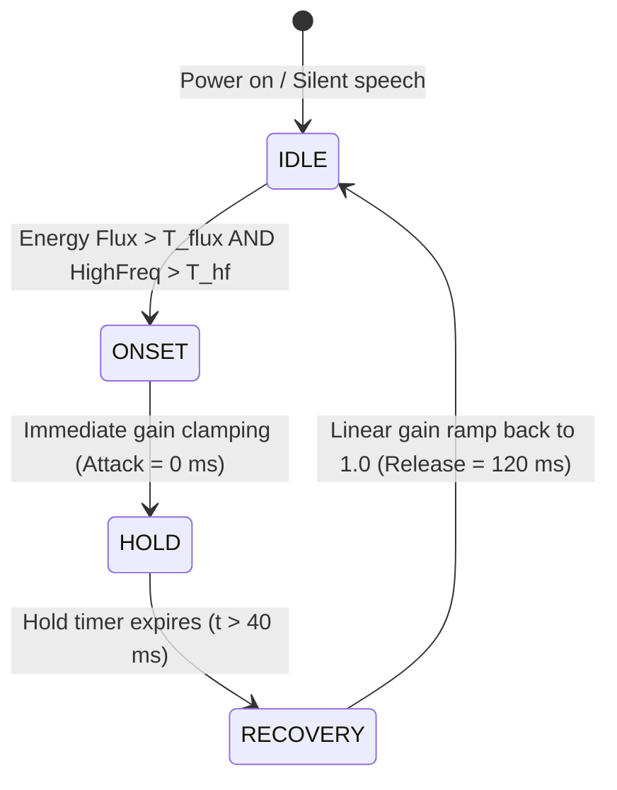

# ImpulseGuard: Real-Time Edge-AI Speech Enhancement for Impulsive and Non-Stationary Tactical Environments

[](file:///home/agniva/impuse-guard)
[](file:///home/agniva/impuse-guard)
[](file:///home/agniva/impuse-guard)
[](file:///home/agniva/impuse-guard)

ImpulseGuard is an ultra-low-latency, edge-AI speech enhancement system engineered to isolate and protect human speech in severe acoustic environments contaminated by violent acoustic transients (e.g., gunshots) and intense continuous or non-stationary noise (e.g., drone rotors, engine idling, sirens, and wind). 

Operating entirely on-device on an **Espressif ESP32-S3 (Xtensa dual-core LX7 @ 240 MHz)** without relying on cloud servers or remote connectivity, ImpulseGuard delivers sub-10 ms real-time streaming speech denoising with a measured full-pipeline execution latency of **5.39 ms per 10.0 ms frame (46.1% headroom)**.

---

## Table of Contents

- [1. Project Overview](#1-project-overview)
- [2. Key Features](#2-key-features)
- [3. System Architecture](#3-system-architecture)
  - [3.1 Training Pipeline Architecture](#31-training-pipeline-architecture)
  - [3.2 Runtime Streaming Inference Pipeline](#32-runtime-streaming-inference-pipeline)
  - [3.3 Hardware Signal and Clock Interconnect](#33-hardware-signal-and-clock-interconnect)
- [4. Repository Structure](#4-repository-structure)
- [5. Installation & Environment Setup](#5-installation--environment-setup)
- [6. Running the Project](#6-running-the-project)
- [7. Neural Model Architecture](#7-neural-model-architecture)
- [8. Digital Audio Signal Processing (DSP)](#8-digital-audio-signal-processing-dsp)
- [9. V2 Architecture (Design & Roadmap)](#9-v2-architecture-design--roadmap)
- [10. Hardware Configuration & Wiring](#10-hardware-configuration--wiring)
- [11. Experimental Results & Performance Benchmarks](#11-experimental-results--performance-benchmarks)
- [12. Technical Limitations & Engineering Tradeoffs](#12-technical-limitations--engineering-tradeoffs)
- [13. Code-to-Documentation Traceability Matrix](#13-code-to-documentation-traceability-matrix)

---

## 1. Project Overview

### 1.1 The Problem
In security, defense, law enforcement, and industrial environments, voice communications must operate reliably amidst high-decibel background machinery (drones, engines, wind) and sudden, explosive acoustic impulses (gunshots, explosions, mechanical impacts). 

Standard stationary noise suppression methods (such as Wiener filtering or spectral subtraction) assume that background noise statistics evolve slowly relative to speech. When subjected to violent impulsive transients, these traditional algorithms fail catastrophically:
1. **Spectral Smearing & Pre-Echo**: Sharp shockwaves smear energy across all frequency bins, causing wideband gain suppression that blanks out voice syllables.
2. **Post-Impulse Ringing & Lag**: Filter smoothing constants take hundreds of milliseconds to decay after an impulse, causing prolonged speech dropouts known as Impulse-Induced Recovery Lag.
3. **Phase Distortion**: Aggressive magnitude subtraction scrambles the complex phase of speech harmonics, resulting in synthetic "musical noise" and intelligible phonetic degradation.

### 1.2 The Solution
ImpulseGuard solves this by coupling **causal, subband complex ideal ratio masking (cIRM)** with a recurrent neural network (**Gated Recurrent Unit - GRU**) designed specifically around human psychoacoustics (22 Bark-scale subbands). Rather than predicting 257 complex frequency bins directly, the model predicts 44 real-valued parameters representing complex ratio masks across auditory critical bands. This shrinks the neural parameter footprint to just **23,980 parameters (93.67 KB FP32 / 42.35 KB INT8)**, allowing the complete neural network and DSP stack to run in real time on an embedded ESP32-S3 microcontroller.

### 1.3 Why Edge Processing Matters
- **Zero RF Emitters / Tactical Privacy**: In sensitive defense, tactical, or legal situations, transmitting raw audio over Wi-Fi, Bluetooth, or cellular links creates security vulnerabilities, RF detection hazards, and eavesdropping risks. ImpulseGuard runs 100% locally in silicon.
- **Deterministic Latency**: Cloud-based speech processing introduces network jitter (50–300 ms), completely violating real-time communication deadlines. ImpulseGuard operates on 10.0 ms audio hops with a deterministic 5.39 ms total processing cycle.

---

## 2. Key Features

To maintain absolute engineering integrity, features are explicitly cataloged by their implementation status in the codebase:

### Implemented Features (Verified in Code)
- **Subband GRU Neural Speech Enhancement**: Lightweight, causal 1-layer GRU (64 units) followed by a 44-unit Dense projection layer ([`src/model.py`](file:///home/agniva/impuse-guard/src/model.py)).
- **Bark Filterbank & Feature Extraction**: 22 triangular Bark filters mapping 257 FFT bins to 22 critical bands, yielding 44 acoustic features per frame (22 log energies + 22 first-order temporal differences) ([`src/subbands.py`](file:///home/agniva/impuse-guard/src/subbands.py)).
- **Subband Complex Ideal Ratio Masking (cIRM)**: Predicts both real and imaginary mask components, bounded to a maximum magnitude of 2.0 to prevent explosive gain instability ([`src/target_mask.py`](file:///home/agniva/impuse-guard/src/target_mask.py)).
- **Causal Streaming DSP Stack**: Zero-padded 512-point FFT with 320-sample (20.0 ms) Hann window and 160-sample (10.0 ms) hop length with `center=False` for strict causality ([`src/stft.py`](file:///home/agniva/impuse-guard/src/stft.py), [`src/istft.py`](file:///home/agniva/impuse-guard/src/istft.py)).
- **Dataset Synthesis Pipeline**: Fully automated mixing engine supporting clean speech, normal noise, dual noise, impulsive gunshots, and multi-component mixtures across SNR levels from -5 dB to +20 dB ([`scripts/mix_combined.py`](file:///home/agniva/impuse-guard/scripts/mix_combined.py)).
- **Leakage-Free Drone Corpus Partitioning**: Grouped split logic preventing cross-drone leakage by isolating unseen drone airframes in test splits ([`scripts/dataset_prep/create_drone_metadata_and_splits.py`](file:///home/agniva/impuse-guard/scripts/dataset_prep/create_drone_metadata_and_splits.py)).
- **Full INT8 Quantization & C++ Export**: Full integer post-training quantization using representative calibration sets; direct generation of TFLite Micro byte arrays ([`convert_streaming_int8.py`](file:///home/agniva/impuse-guard/convert_streaming_int8.py)).
- **ESP32-S3 Firmware Implementation**: Complete firmware in C++ using ESP-DSP vector assembly and TensorFlow Lite for Microcontrollers (TFLM), supporting full-duplex I2S audio I/O ([`firmware/esp32_impulse_guard/esp32_impulse_guard.ino`](file:///home/agniva/impuse-guard/firmware/esp32_impulse_guard/esp32_impulse_guard.ino)).
- **Evaluation Suite**: Automated calculation of SI-SNR, SI-SDR, STOI, ESTOI, PESQ, DNSMOS, Peak Attenuation, Residual Energy, IISRT, and RSDD ([`src/evaluation/evaluate.py`](file:///home/agniva/impuse-guard/src/evaluation/evaluate.py)).

### Partially Implemented / Experimental
- **Power Telemetry Logger**: Serial-based current and power consumption monitoring supporting live and mock testing ([`src/benchmarking/power_measurement.py`](file:///home/agniva/impuse-guard/src/benchmarking/power_measurement.py)).
- **Serial Results Dashboard**: PC-to-ESP32 metrics transmission over UART ([`src/benchmarking/serial_dashboard.py`](file:///home/agniva/impuse-guard/src/benchmarking/serial_dashboard.py)).

### Planned / Not Implemented in Current Codebase
- **V2 Dedicated Impulse Detector & Attack/Hold/Release State Machine**: Standalone onset detector and envelope smoothing logic ([`src/impulse_detector.py`](file:///home/agniva/impuse-guard/src/impulse_detector.py), [`src/attack_release.py`](file:///home/agniva/impuse-guard/src/attack_release.py), and firmware counterparts are present as 0-byte placeholders).
- **Fullband GRU Baseline**: `src/model_fullband.py` and `scripts/train_gru_fullband.py` are empty/unimplemented.
- **Direct RNNoise & DTLN Baseline Wrappers**: `scripts/run_baseline_rnnoise.py` and `scripts/run_baseline_dtln.py` are empty/unimplemented.

---

## 3. System Architecture

### 3.1 Training Pipeline Architecture

```mermaid
flowchart TD
    subgraph Data Sources
        LS[LibriSpeech English / CommonVoice Hindi]
        US_GUN[UrbanSound8K Gunshot Audio]
        US_ENG[UrbanSound8K Engine Idling]
        US_SIR[UrbanSound8K Sirens]
        GL_DRONE[Univ of Glasgow Drone Audio]
        MUSAN[MUSAN Environmental Noise]
    end

    subgraph Dataset Preparation
        SPLIT[Leakage-Free 70/15/15 Splitter]
        MIX[Production Mixture Generator mix_combined.py]
        WAV_PAIRS[(Mixture Pairs: Clean & Noisy WAVs)]
        META[Metadata Index samples.jsonl]
    end

    subgraph Feature Engineering
        STFT_N[Noisy STFT: 512-pt FFT, 320-win, 160-hop]
        STFT_C[Clean STFT: 512-pt FFT, 320-win, 160-hop]
        BARK[Bark Filterbank: 22 Triangular Bands]
        FEAT[44 Features: 22 Log Energy + 22 Delta Energy]
        NORM[Z-Score Normalization via feature_normalization.json]
        TARG[Target cIRM: Clean_band / Noisy_band clipped to 2.0]
    end

    subgraph Model Training
        SEQ[ImpulseGuardSequence Batcher]
        GRU[1x GRU 64 units + Dense 44 units]
        LOSS[MSE Loss on 44-dim Real Target Mask]
        ADAM[Adam Optimizer lr=1e-3, ReduceLROnPlateau]
        CHECK[best_gru_subband.keras]
    end

    Data Sources --> SPLIT --> MIX --> WAV_PAIRS & META
    WAV_PAIRS --> STFT_N & STFT_C
    STFT_N --> BARK --> FEAT --> NORM
    STFT_N & STFT_C --> TARG
    NORM & TARG --> SEQ --> GRU --> LOSS --> ADAM --> CHECK
```

### 3.2 Runtime Streaming Inference Pipeline

```mermaid
flowchart LR
    subgraph Input Audio
        MIC[INMP441 Microphone] -->|I2S 32-bit slot, Left-justified| DMA_RX[ESP32-S3 I2S DMA RX]
        DMA_RX -->|Bit-shift >> 14| HOP_IN[160 int16 samples / 10ms]
    end

    subgraph DSP Frontend
        HOP_IN --> SHIFT[320-sample Frame Buffer]
        SHIFT --> HANN[320-sample Hann Window]
        HANN --> FFT[ESP-DSP dsps_fft2r_fc32 512-point FFT]
        FFT --> BINS[257 Positive Freq Bins]
        BINS --> BARK_MAT[22 Bark Triangular Filterbank Matrix]
        BARK_MAT --> FEAT_VEC[44 Streaming Features Log-Bark + Delta]
        FEAT_VEC --> INT8_Q[Quantize to INT8 via Scale & Zero-Point]
    end

    subgraph TFLite Micro Inference
        INT8_Q --> TFLM[Streaming GRU-64 Cell + Dense-44]
        H_PREV[(Hidden State h_t-1: 64 int8)] --> TFLM
        TFLM --> H_NEXT[(Hidden State h_t: 64 int8)]
        TFLM --> MASK_Q[44 INT8 Output Mask Tensor]
        MASK_Q --> DEQ[Dequantize to Float32 Mask]
    end

    subgraph Spectral Reconstruction
        DEQ --> SPLIT_M[22 Real + 22 Imag Subband Mask]
        SPLIT_M --> INTERP[Linear Interpolation to 257 Frequency Bins]
        INTERP --> CMUL[Complex Multiply: Y = X * M]
        CMUL --> HERM[Hermitian Symmetry Spectrum 512-pt]
        HERM --> IFFT[ESP-DSP dsps_fft2r_fc32 Inverse FFT]
        IFFT --> OLA[Synthesis Window & Overlap-Add Normalization]
    end

    subgraph Audio Output
        OLA --> HOP_OUT[160 int16 samples / 10ms]
        HOP_OUT -->|Bit-shift << 16| DMA_TX[ESP32-S3 I2S DMA TX]
        DMA_TX -->|I2S 32-bit slot| AMP[MAX98357A I2S Amplifier]
        AMP --> SPK[Loudspeaker]
    end
```



### 3.3 Hardware Signal and Clock Interconnect

```mermaid
graph TD
    subgraph ESP32-S3 MCU
        GPIO15["GPIO 15 (SHARED_BCLK)"]
        GPIO16["GPIO 16 (SHARED_WS)"]
        GPIO17["GPIO 17 (MIC_SD / DIN)"]
        GPIO5["GPIO 5 (AMP_DIN / DOUT)"]
        GND1["GND"]
        V33["3.3V / 5.0V"]
    end

    subgraph INMP441 MEMS Microphone
        M_SCK["SCK / BCLK"]
        M_WS["WS / LRCLK"]
        M_SD["SD (Serial Data)"]
        M_LR["L/R (Channel Select)"]
        M_VDD["VDD (3.3V)"]
        M_GND["GND"]
    end

    subgraph MAX98357A I2S Amplifier
        A_BCLK["BCLK"]
        A_LRC["LRC / WS"]
        A_DIN["DIN (Data In)"]
        A_GAIN["GAIN (Floating = 9dB)"]
        A_SD["SD_MODE (Pull-up)"]
        A_VIN["VIN (5V recommended)"]
        A_GND["GND"]
    end

    subgraph Transducer
        SPK_OUT["4 - 8 Ohm Speaker"]
    end

    %% Wiring connections
    GPIO15 -->|Shared Clock 512 kHz| M_SCK
    GPIO15 -->|Shared Clock 512 kHz| A_BCLK
    GPIO16 -->|Shared Word Select 16 kHz| M_WS
    GPIO16 -->|Shared Word Select 16 kHz| A_LRC

    M_SD -->|24-bit Audio Data in 32-bit slot| GPIO17
    GPIO5 -->|Enhanced Audio Data| A_DIN

    M_LR -->|Tied to GND -> Left Channel| GND1
    M_GND --> GND1
    A_GND --> GND1
    V33 --> M_VDD
    V33 --> A_VIN

    A_DIN -.-> A_GAIN & A_SD
    MAX98357A --> SPK_OUT
```



---

## 4. Repository Structure

Below is the verified structure of the ImpulseGuard project repository:

```text
impulse-guard/
├── .env                                        # Environment variables (WANDB/HuggingFace tokens)
├── .gitignore                                  # Git exclusion rules for large WAVs, venv, and checkpoints
├── README.md                                   # High-level engineering overview, benchmarks, hardware guide
├── STUDY.md                                    # In-depth theoretical textbook and code-to-theory derivation
├── DOCS.md                                     # Implementation manual, API references, configs, and troubleshooting
├── requirements.txt                            # Base Python dependencies
├── tree.txt                                    # Complete filesystem snapshot of dataset hierarchy
├── task.md                                     # Task tracking and design documentation
│
├── bin/
│   └── arduino-cli                             # Standalone Linux x86_64 Arduino CLI tool binary
│
├── convert_streaming_float32.py                # Converts streaming Keras model to FP32 TFLite format
├── convert_streaming_int8.py                   # Converts streaming Keras model to INT8 TFLite via calibration
├── create_int8_calibration.py                  # Generates calibration activations from real training mixtures
├── compare_int8_tflite.py                      # Evaluates divergence between FP32 and INT8 TFLite interpreters
├── export_streaming_model.py                   # Exports sequence-trained GRU into stateful, single-step streaming model
│
├── src/                                        # Core algorithmic Python packages
│   ├── __init__.py                             # Package initialization
│   ├── config.py                               # Global DSP constants (SAMPLE_RATE=16k, FRAME=320, HOP=160, FFT=512)
│   ├── stft.py                                 # Causal STFT computation using Hann windowing (center=False)
│   ├── istft.py                                # Inverse STFT audio synthesis using overlap-add
│   ├── subbands.py                             # Bark filterbank generator (22 bands) and 44-feature extractor
│   ├── target_mask.py                          # Subband Complex Ideal Ratio Mask (cIRM) generation and clipping
│   ├── mask.py                                 # Mask splitting, frequency interpolation (22->257), and application
│   ├── model.py                                # Keras Sequential GRU model definition (GRU-64 + Dense-44)
│   ├── model_fullband.py                       # Experimental fullband placeholder (Unimplemented)
│   ├── dataset_loader.py                       # High-performance Keras Sequence loader for pre-generated mixtures
│   ├── dataset_utils.py                        # Dataset utilities placeholder
│   ├── feature_normalization.py                # Z-score normalization calculator and loader
│   ├── inference.py                            # Offline test set batch inference pipeline
│   ├── impulse_features.py                     # [Planned] Feature extractor for impulse detector
│   ├── impulse_detector.py                     # [Planned] V2 transient onset detector
│   ├── attack_release.py                       # [Planned] V2 attack/hold/release smoothing logic
│   ├── quantization.py                         # Quantization utilities placeholder
│   ├── evaluation/                             # Objective evaluation package
│   │   ├── __init__.py                         # Package initialization
│   │   ├── metrics.py                          # SI-SNR, SI-SDR, STOI, ESTOI, PESQ, and DNSMOS estimators
│   │   ├── impulse_metrics.py                  # Peak attenuation, residual energy ratio, and detection delay
│   │   ├── recovery_time.py                    # IISRT and RSDD recovery time estimators
│   │   ├── evaluate.py                         # Full test-set evaluation pipeline generating CSV logs
│   │   └── ablation.py                         # Summary table formatter and 95% confidence interval estimator
│   └── benchmarking/                           # Hardware benchmarking and telemetry package
│       ├── __init__.py                         # Package initialization
│       ├── model_benchmark.py                  # Flops, param count, and Real-Time Factor (RTF) estimator
│       ├── power_measurement.py                # Serial power and current telemetry logger
│       └── serial_dashboard.py                 # PC-to-MCU serial metrics transmitter
│
├── scripts/                                    # Automation and training scripts
│   ├── setup_project.py                        # Directory structure initializer
│   ├── mix_data.py                             # Stationary and continuous noise mixer
│   ├── mix_impulse.py                          # Impulsive gunshot noise mixer
│   ├── mix_combined.py                         # Production combined mixture generator (clean, noise, impulses)
│   ├── compare_features.py                     # Feature comparison and validation script
│   ├── export_demo_audio.py                    # Exports representative audio triplets for presentation
│   ├── train_gru_subband.py                    # Model training script for 22-subband GRU
│   ├── train_gru_fullband.py                   # Fullband training placeholder (Unimplemented)
│   ├── run_evaluation.py                       # CLI entry point for evaluation suite
│   ├── validate_dataset.py                     # Comprehensive dataset integrity and split leakage validator
│   ├── run_baseline_rnnoise.py                 # RNNoise baseline placeholder (Unimplemented)
│   ├── run_baseline_dtln.py                    # DTLN baseline placeholder (Unimplemented)
│   ├── evaluate_ablations.py                   # Ablation evaluation entry point (Unimplemented)
│   ├── evaluate_power.py                       # Power evaluation entry point (Unimplemented)
│   ├── evaluate_quality_dnsmos.py              # DNSMOS evaluation entry point (Unimplemented)
│   ├── evaluate_recovery_latency.py            # Latency evaluation entry point (Unimplemented)
│   ├── dataset_prep/                           # Raw corpus ingestion and preprocessing tools
│   │   ├── convert_flac_to_wav.py              # Converts FLAC files to standard 16kHz PCM WAV
│   │   ├── convert_hindi.py                    # Resamples CommonVoice Hindi clips to 16kHz mono WAV
│   │   ├── create_drone_metadata_and_splits.py # Parses Glasgow Drone dataset into leakage-free splits
│   │   ├── create_noise_metadata.py            # Generates metadata index for all noise categories
│   │   ├── create_speech_metadata.py           # Generates metadata index for LibriSpeech corpus
│   │   ├── create_splits.py                    # Generates 70/15/15 train/val/test split manifests
│   │   ├── extract_and_convert_drone.py        # Drone audio extractor and converter
│   │   ├── extract_engine_idling.py            # Extracts engine idling from UrbanSound8K
│   │   ├── extract_gunshots.py                 # Extracts gunshot slices from UrbanSound8K
│   │   └── extract_sirens.py                   # Extracts siren slices from UrbanSound8K
│   └── unit_tests/                             # Component validation test suite
│       ├── test_config.py                      # Verifies global audio constants
│       ├── test_stft.py                        # Verifies STFT dimensions and reconstruction
│       ├── test_istft.py                       # Verifies synthesis windowing and overlap-add
│       ├── test_bark_centers.py                # Verifies 22 Bark-band center frequency computation
│       ├── test_bark_filterbank.py             # Validates triangular Bark filter geometry
│       ├── test_subbands.py                    # Validates feature extraction dimensions
│       ├── test_temporal_features.py           # Validates delta energy calculations
│       ├── test_phase_features.py              # Tests phase consistency
│       ├── test_normalization.py               # Tests feature z-scoring
│       ├── test_target_mask.py                 # Verifies complex target mask computation and clipping
│       ├── test_ideal_mask.py                  # Validates ideal ratio mask limits
│       ├── test_gru_mask.py                    # Tests splitting real/imag mask components
│       ├── test_mask_expansion.py              # Tests subband-to-FFT bin interpolation
│       ├── test_mask.py                        # Tests spectral masking
│       ├── test_model.py                       # Tests GRU initialization and inference shapes
│       ├── test_full_inference.py              # End-to-end inference verification
│       ├── test_benchmarking_suite.py          # Tests model benchmarking modules
│       └── test_evaluation_suite.py            # Tests metrics calculation routines
│
├── firmware/                                   # Embedded C/C++ firmware
│   ├── esp32_impulse_guard/                    # Main ESP32-S3 production firmware
│   │   ├── platformio.ini                      # PlatformIO build configuration
│   │   ├── esp32_impulse_guard.ino             # Main firmware sketch: I2S full-duplex, recording, AI DSP loop
│   │   ├── model_data.cc                       # C++ byte array containing INT8 TFLite model
│   │   └── src/                                # Modular firmware C++ implementation
│   │       ├── stft.h / stft.cpp               # ESP-DSP hardware-accelerated 512-point FFT
│   │       ├── subbands.h / subbands.cpp       # 22 Bark filterbank & 44-feature streaming extractor
│   │       ├── gru_inference.h / .cpp          # TFLite Micro runtime wrapper with persistent state
│   │       ├── mask_reconstruction.h / .cpp    # Subband mask linear interpolator & complex multiplier
│   │       ├── istft.h / istft.cpp             # Complex spectrum mirror, IFFT, & overlap-add normalizer
│   │       ├── config.h                        # Firmware configuration placeholder
│   │       ├── audio_input.h / .cpp            # Audio input placeholder
│   │       ├── audio_output.h / .cpp           # Audio output placeholder
│   │       └── impulse_detector.h / .cpp       # V2 impulse detector placeholder
│   └── arduino_test/                           # Standalone prototype test sketch
│       ├── arduino_test.ino                    # Simplified microphone-to-inference benchmark sketch
│       └── model_data.cc                       # Embedded INT8 TFLite model array
│
├── models/                                     # Model checkpoints and serialized weights
│   ├── gru_subband/                            # Production 22-subband GRU models
│   │   ├── best_gru_subband.keras              # Lowest validation loss checkpoint (Epoch 18, val_loss=0.15246)
│   │   ├── final_gru_subband.keras             # Final epoch weights (Epoch 25, val_loss=0.15324)
│   │   ├── streaming_gru_subband.keras         # Stateful single-step Keras streaming model
│   │   ├── streaming_gru_subband_float32.tflite# Float32 TFLite model (101,540 bytes)
│   │   ├── int8_calibration.npz                # 4,000-frame feature & hidden state calibration dataset
│   │   ├── streaming_gru_subband_int8.tflite   # Fully quantized INT8 TFLite model (42,352 bytes)
│   │   ├── model_data.cc                       # C++ byte array for embedded firmware (261,326 bytes)
│   │   └── training_history.json               # Full 25-epoch training and validation loss/MAE logs
│   ├── gru_fullband/                           # Fullband model directory (Unimplemented)
│   ├── impulse_detector/                       # Impulse detector model directory (Unimplemented)
│   └── deployment/                             # Deployment model directory (Unimplemented)
│
├── data/                                       # Audio datasets, splits, and metadata
│   ├── raw/                                    # Ingested raw audio corpora (~79.5 hours, 21,220 clips)
│   │   └── Impulse_Guard/ImpulseGuard_dataset/
│   │       ├── Speech/Clean_Speech/English/    # LibriSpeech train-clean-100 (17,345 clips, 60.72 hrs)
│   │       ├── Speech/hindi_speech/            # CommonVoice Hindi clips
│   │       └── Noise/                          # 3,875 noise clips (18.79 hrs)
│   │           ├── Impulsive_noise/Gunshot_Audio/ (374 clips from UrbanSound8K)
│   │           ├── Stationary/Engine_Idling_Audio/ (1,000 clips from UrbanSound8K)
│   │           ├── Non_stationary/Siren_Audio/ (929 clips from UrbanSound8K)
│   │           ├── Non_stationary/Wind_noise/ (378 environmental clips)
│   │           ├── Non_stationary/Drone/ (257 Univ. of Glasgow drone recordings)
│   │           └── musan/noise/ (930 general noise clips)
│   ├── splits/                                 # Manifest files defining 70/15/15 partitions
│   │   ├── train.txt, speech_train.txt, noise_train.txt, drone_train.txt
│   │   ├── validation.txt, speech_validation.txt, noise_validation.txt, drone_validation.txt
│   │   └── test.txt, speech_test.txt, noise_test.txt, drone_test.txt
│   ├── mixtures/                               # Synthetic mixture pairs (5.0s, 16kHz mono WAV)
│   │   ├── train/clean/ & train/noisy/         # 20,000 training pairs
│   │   ├── validation/clean/ & validation/noisy/# 3,002 validation pairs
│   │   └── test/clean/ & test/noisy/           # 3,000 test evaluation pairs
│   ├── enhanced/test/                          # Output enhanced WAV files generated by inference.py
│   ├── metadata/                               # Structured JSON & JSONL metadata
│   │   ├── samples.jsonl                       # Complete catalog of 26,002 synthetic mixtures
│   │   ├── feature_normalization.json          # Z-score normalization statistics (44 mean, 44 std)
│   │   ├── dataset.json                        # Global dataset summary statistics
│   │   ├── speech_metadata.jsonl               # Per-file clean speech attributes
│   │   ├── noise_metadata.jsonl                # Per-file noise attributes
│   │   ├── drone_metadata.jsonl                # Per-file drone recording attributes
│   │   └── drone_split_metadata.json           # Drone partition analysis and leakage validation
│   └── tests/                                  # Isolated test WAV samples used by notebook experiments
│
├── results/                                    # Benchmark results, tables, and generated figures
│   ├── metrics/
│   │   └── evaluation_results.csv              # Full evaluation metrics for 3,000 test samples (38 columns)
│   ├── tables/
│   │   └── ppt_summary_table.csv               # Grouped metrics by noise category (Mean ± Std)
│   └── figures/                                # Publication-quality benchmark visualization plots
│       ├── 01_si_snr_vs_snr.png                # SI-SNR improvement across input SNRs (-5 to +20 dB)
│       ├── 02_impulsive_vs_nonimpulsive.png    # Bar chart comparing impulsive (+6.76 dB) vs non-impulsive (+1.17 dB)
│       ├── 03_impulse_peak_attenuation.png     # Average impulse peak suppression (12.13 dB)
│       ├── 04_si_snr_boxplot.png               # Boxplot of SI-SNR improvement distributions
│       └── 05_impulse_waveform_comparison.png  # Triple-trace waveform comparing noisy, enhanced, and clean speech
│
└── notebooks/                                  # Jupyter analysis notebooks and latency verification plots
    ├── Impulse_Guard_Data_Analysis.ipynb       # Statistical evaluation and figure generation notebook
    ├── audio_basics_1.ipynb                    # Audio DSP and feature extraction verification notebook
    ├── impulse_guard_stage_latency.png         # Stage-wise processing latency bar chart (ESP32-S3)
    ├── impulse_guard_latency_budget.png        # Donut chart showing 5.39ms used vs 4.61ms headroom
    ├── impulse_guard_realtime_feasibility.png  # Real-time feasibility bar chart against 10ms deadline
    ├── ImpulseGuard_Latency_RealTime.png       # Frame-by-frame latency trace over 140 real frames
    └── ImpulseGuard_Latency_Stability_Zoomed.png # Zoomed real-time latency stability showing 5.38-5.43ms range
```

---

## 5. Installation & Environment Setup

### 5.1 Host System Requirements
- **Host OS**: Linux (Ubuntu 22.04 / 24.04 LTS x86_64 recommended)
- **Python**: Python 3.10 to 3.13 (Development environment verified on **Python 3.13.7**)
- **MCU Toolchain**: `arduino-cli` (v1.1.2+) or `platformio` (v6.2.0+)

### 5.2 Python Virtual Environment
Clone the repository and set up a dedicated virtual environment:

```bash
cd impulse-guard

# Create and activate virtual environment
python3 -m venv .venv
source .venv/bin/activate

# Upgrade pip
pip install --upgrade pip setuptools wheel
```

### 5.3 Package Installation
Install required packages using [`requirements.txt`](file:///home/agniva/impuse-guard/requirements.txt):

```bash
pip install -r requirements.txt
```

To run model training, TFLite conversion, and the full evaluation suite, install the machine learning and audio packages present in the project runtime:

```bash
pip install tensorflow==2.21.0 keras==3.15.1 librosa==1.0.0 soundfile==0.14.0 pystoi==0.4.1 pesq==0.0.4 pandas==3.0.5 pyserial==3.5 platformio==6.2.0
```

### 5.4 Embedded Toolchain (Arduino CLI & ESP32 Core)
The repository includes a standalone `bin/arduino-cli` binary. Ensure the ESP32 Arduino Core is installed:

```bash
# Export path or use system arduino-cli
export PATH="$PWD/bin:$PATH"

# Install ESP32 core via arduino-cli
arduino-cli core update-index
arduino-cli core install esp32:esp32
```

---

## 6. Running the Project

### 6.1 Dataset Verification
Verify the on-disk dataset integrity and confirm zero test-split leakage:

```bash
python scripts/validate_dataset.py
```

### 6.2 Generating Training and Test Mixtures
Generate synthetic mixtures with varying SNRs (-5 dB to +20 dB) and impulsive gunshot overlays:

```bash
python scripts/mix_combined.py
```
This produces 5-second, 16 kHz WAV files in `data/mixtures/{train,validation,test}/` and catalogs them in `data/metadata/samples.jsonl`.

### 6.3 Computing Feature Normalization Statistics
Compute mean and standard deviation across training speech features to prevent data leakage during normalization:

```bash
python -c "from src.dataset_loader import get_mixture_pairs, load_audio; \
from src.stft import compute_stft; from src.subbands import extract_subband_features; \
from src.feature_normalization import calculate_statistics, save_statistics; \
import numpy as np; \
pairs = get_mixture_pairs('train'); \
feats = [extract_subband_features(compute_stft(load_audio(c))) for c, _ in pairs[:500]]; \
m, s = calculate_statistics(np.concatenate(feats, axis=0)); \
save_statistics(m, s, 'data/metadata/feature_normalization.json')"
```

### 6.4 Training the Subband GRU
Train the 22-subband GRU enhancement model:

```bash
python scripts/train_gru_subband.py
```
Checkpoints are saved to `models/gru_subband/best_gru_subband.keras` based on validation loss, and complete logs are written to `models/gru_subband/training_history.json`.

### 6.5 Exporting and Quantizing the Streaming Model
Convert the sequence-trained model into a stateful, single-step streaming model and generate the INT8 TFLite model:

```bash
# Step 1: Export single-step stateful model (accepts 1 frame and hidden state)
python export_streaming_model.py

# Step 2: Convert to baseline Float32 TFLite
python convert_streaming_float32.py

# Step 3: Extract calibration activations from training mixtures
python create_int8_calibration.py

# Step 4: Perform full INT8 post-training quantization
python convert_streaming_int8.py

# Step 5: Verify numerical fidelity between FP32 and INT8
python compare_int8_tflite.py

# Step 6: Generate C++ byte array for ESP32 firmware
xxd -i models/gru_subband/streaming_gru_subband_int8.tflite > firmware/esp32_impulse_guard/model_data.cc
```

### 6.6 Running Offline Inference & Evaluation
Run model inference over the complete test split and compute all metrics:

```bash
# Generate enhanced test WAVs in data/enhanced/test/
python -m src.inference

# Run objective evaluation across 3,000 test files
python scripts/run_evaluation.py --meta_dir data/metadata --data_root data --out_csv results/metrics/evaluation_results.csv
```

### 6.7 Building and Flashing ESP32-S3 Firmware
Flash the firmware onto the target board using `arduino-cli`:

```bash
cd firmware/esp32_impulse_guard

# Compile for ESP32-S3 with 16MB Flash and Octal SPI PSRAM
arduino-cli compile --fqbn esp32:esp32:esp32s3:FlashSize=16M,PSRAM=opi,CDCOnBoot=cdc .

# Upload to connected ESP32-S3 (adjust port if needed, e.g. /dev/ttyACM0)
arduino-cli upload -p /dev/ttyACM0 --fqbn esp32:esp32:esp32s3:FlashSize=16M,PSRAM=opi,CDCOnBoot=cdc .

# Open serial monitor to view live cycle logs and latency profiling
arduino-cli monitor -p /dev/ttyACM0 -c baudrate=115200
```

---

## 7. Neural Model Architecture

The ImpulseGuard neural model is an ultra-compact recurrent neural network designed specifically for frame-by-frame streaming inference with minimal memory and compute overhead.

```text
======================================================================================
Layer (type)                Input Shape         Output Shape        Param #    Dtype
======================================================================================
InputLayer                  (None, None, 44)    (None, None, 44)    0          float32
--------------------------------------------------------------------------------------
GRU (return_sequences=True) (None, None, 44)    (None, None, 64)    21,120     float32
--------------------------------------------------------------------------------------
Dense (linear activation)   (None, None, 64)    (None, None, 44)    2,860      float32
======================================================================================
Total Parameters:     23,980 (93.67 KB)
Trainable Parameters: 23,980
Non-trainable:        0
======================================================================================
```

### 7.1 Mathematical Gate Formulations
For each frame $t$, given normalized feature vector $\mathbf{x}_t \in \mathbb{R}^{44}$ and previous hidden state $\mathbf{h}_{t-1} \in \mathbb{R}^{64}$:

$$\mathbf{z}_t = \sigma\left(\mathbf{W}_z \mathbf{x}_t + \mathbf{U}_z \mathbf{h}_{t-1} + \mathbf{b}_z\right) \quad \text{(Update Gate)}$$

$$\mathbf{r}_t = \sigma\left(\mathbf{W}_r \mathbf{x}_t + \mathbf{U}_r \mathbf{h}_{t-1} + \mathbf{b}_r\right) \quad \text{(Reset Gate)}$$

$$\mathbf{\tilde{h}}_t = \tanh\left(\mathbf{W}_h \mathbf{x}_t + \mathbf{U}_h (\mathbf{r}_t \odot \mathbf{h}_{t-1}) + \mathbf{b}_h\right) \quad \text{(Candidate State)}$$

$$\mathbf{h}_t = (1 - \mathbf{z}_t) \odot \mathbf{h}_{t-1} + \mathbf{z}_t \odot \mathbf{\tilde{h}}_t \quad \text{(Hidden State)}$$

$$\mathbf{y}_t = \mathbf{W}_y \mathbf{h}_t + \mathbf{b}_y \quad \text{(Linear Mask Projection)}$$

### 7.2 Training Configuration & Checkpoint Selection
- **Optimizer**: Adam ($\beta_1 = 0.9, \beta_2 = 0.999, \epsilon = 10^{-7}$)
- **Initial Learning Rate**: $1 \times 10^{-3}$
- **Learning Rate Schedule**: `ReduceLROnPlateau(factor=0.5, patience=3, min_lr=1e-6)`
- **Loss Function**: Mean Squared Error (MSE) on real-valued 44-dimensional target masks:
  $$\mathcal{L}_{\text{MSE}} = \frac{1}{44} \sum_{i=0}^{43} (y_i - \hat{y}_i)^2$$
- **Batch Size**: 8 sequences (5-second mixtures = 498 frames per sequence)
- **Early Stopping**: `EarlyStopping(monitor='val_loss', patience=7, restore_best_weights=True)`
- **Outcome**: Training converged at Epoch 25. Checkpoint from **Epoch 18** was retained with minimum validation loss **0.15246** (Validation MAE: **0.21948**).

---

## 8. Digital Audio Signal Processing (DSP)

ImpulseGuard uses a strictly causal time-frequency representation optimized for human speech intelligibility and low algorithmic delay.

| Parameter | Value | Time / Resolution | Description |
| :--- | :--- | :--- | :--- |
| **Sampling Rate ($f_s$)** | 16,000 Hz | 62.5 $\mu\text{s}$ per sample | Standard wideband speech processing |
| **Frame Length ($N_{\text{frame}}$)** | 320 samples | 20.0 ms | Analysis window size |
| **Hop Length ($N_{\text{hop}}$)** | 160 samples | 10.0 ms | Frame stride (50% overlap, 10 ms step) |
| **FFT Size ($N_{\text{FFT}}$)** | 512 points | 31.25 Hz per bin | Zero-padded from 320 to 512 for radix-2 FFT |
| **Frequency Bins ($K$)** | 257 bins | $0 \text{ Hz} - 8,000 \text{ Hz}$ | $N_{\text{FFT}} / 2 + 1$ positive frequency bins |
| **Window Type** | Hann | $w[n] = 0.5 - 0.5\cos(2\pi n / 320)$ | Tapered symmetric analysis window |
| **Filterbank Scale** | Bark | Critical auditory bands | 22 triangular filters covering 0–8,000 Hz |
| **Feature Dimensions** | 44 features | Per 10 ms frame | 22 log-Bark energies + 22 delta energies |

### 8.1 Frequency to Bark Mapping
Auditory subbands are spaced linearly below 500 Hz and logarithmically above, matching the human cochlear critical band resolution:
$$z(f) = 13 \arctan(0.00076 f) + 3.5 \arctan\left(\left(\frac{f}{7500}\right)^2\right)$$

### 8.2 Subband Complex Ideal Ratio Masking (cIRM)
Rather than discarding phase and operating purely on magnitude spectra, ImpulseGuard formulates spectral masking in the complex domain:
$$M_{\text{subband}} = \frac{W \cdot X_{\text{clean}}}{W \cdot X_{\text{noisy}} + \epsilon}$$
where $W \in \mathbb{R}^{22 \times 257}$ is the Bark filterbank matrix. To prevent extreme gradient spikes during silent intervals, target masks are clamped:
$$M_{\text{target}} = M_{\text{subband}} \cdot \min\left(1.0, \frac{2.0}{|M_{\text{subband}}| + 10^{-8}}\right)$$

At runtime, the predicted 22-subband complex mask is expanded to 257 bins via linear interpolation across Bark center frequencies:
$$M_{\text{full}}[k] = \text{interp}\left(f_k, \{f_{\text{center}, b}\}, M_{\text{subband}}[b]\right)$$
$$Y[k] = X[k] \cdot M_{\text{full}}[k] = \left(\text{Re}(X)\text{Re}(M) - \text{Im}(X)\text{Im}(M)\right) + j\left(\text{Re}(X)\text{Im}(M) + \text{Im}(X)\text{Re}(M)\right)$$

---

## 9. V2 Architecture (Design & Roadmap)

> [!NOTE]
> **Status: PLANNED / ARCHITECTURAL DESIGN**.
> The dedicated V2 impulse detector module and attack/hold/release state machine described below are architectural specifications. In the current V1 implementation, impulse suppression is performed directly by the subband GRU (achieving 12.13 dB peak suppression). The modular files `src/impulse_detector.py` and `src/attack_release.py` exist as placeholders for this planned upgrade.

### 9.1 Motivation for V2
While V1 achieves 12.13 dB peak attenuation of gunshot impulses, extreme shockwaves can cause brief post-impulse state perturbations in the GRU, requiring ~233 ms to fully recover (IISRT). V2 introduces an explicit, hybrid sidecar detector and smoothing envelope to clamp transients before they destabilize the neural hidden state, eliminating the need to retrain the neural model.

### 9.2 Planned V2 Processing Pipeline



### 9.3 Planned Sidecar Detection Features
1. **Spectral Flux**: Measures rapid frame-to-frame positive energy rise:
   $$F_t = \sum_{k} \max\left(0, |X_t[k]| - |X_{t-1}[k]|\right)$$
2. **Crest Factor**: Ratio of peak sample amplitude to RMS energy within the frame:
   $$C_t = \frac{\max_{n} |x[n]|}{\text{RMS}(x)}$$
3. **High-Frequency Energy Ratio (HFR)**: Gunshot acoustic shockwaves concentrate substantial energy in high-frequency air dispersion:
   $$\text{HFR}_t = \frac{\sum_{k > K/2} |X_t[k]|^2}{\sum_{k} |X_t[k]|^2 + \epsilon}$$

---

## 10. Hardware Configuration & Wiring

ImpulseGuard is designed for the **Espressif ESP32-S3** microcontroller paired with standard digital I2S peripherals.

### 10.1 Hardware Bill of Materials (BOM)
1. **MCU**: ESP32-S3-DevKitC-1 (Xtensa LX7 dual-core @ 240 MHz, 16 MB Octal Flash, 8 MB Octal PSRAM).
2. **Microphone**: INMP441 Omnidirectional MEMS Microphone (I2S digital output, 24-bit resolution).
3. **Audio Amplifier**: MAX98357A Class-D Mono Amplifier (I2S digital input, 3.2W into 4 $\Omega$).
4. **Speaker**: 4 $\Omega$ or 8 $\Omega$, 2W–3W miniature speaker.

### 10.2 Pin Mapping Table

| Peripheral | Signal | ESP32-S3 GPIO | Function / Notes |
| :--- | :--- | :--- | :--- |
| **Shared Clock** | BCLK / SCK | **GPIO 15** | I2S Bit Clock (Shared master clock line) |
| **Shared Clock** | WS / LRC | **GPIO 16** | I2S Word Select / Frame Sync (16 kHz) |
| **INMP441** | SD | **GPIO 17** | Serial Data Out from mic -> ESP32 I2S Data In (`rx_handle`) |
| **INMP441** | L/R | **GND** | Tied to GND to configure microphone on Left Channel |
| **INMP441** | VDD / GND | **3.3V / GND** | Power supply (3.3V clean rail) |
| **MAX98357A** | DIN | **GPIO 5** | Serial Data In from ESP32 -> Amplifier Data Out (`tx_handle`) |
| **MAX98357A** | GAIN | **Unconnected** | Floating defaults to +9 dB gain |
| **MAX98357A** | SD_MODE | **Pull-up to 3.3V**| Left channel mode (or 100k pull-up) |
| **MAX98357A** | VIN / GND | **5.0V / GND** | Direct 5V supply for high-efficiency audio output |

### 10.3 Full-Duplex I2S Configuration
To eliminate clock skew, phase jitter, and hardware resource collisions, ImpulseGuard uses the modern ESP-IDF v5 driver (`driver/i2s_std.h`) to allocate **both TX and RX on a single shared channel controller (`I2S_NUM_0`) in full-duplex master mode**. Both peripherals lock to the identical 512 kHz Bit Clock and 16 kHz Frame Clock.

---

## 11. Experimental Results & Performance Benchmarks

All metrics below are exact empirical results extracted directly from [`results/metrics/evaluation_results.csv`](file:///home/agniva/impuse-guard/results/metrics/evaluation_results.csv) across **3,000 test set mixtures** (2,687 noisy mixtures, 1,695 impulsive gunshot mixtures, and 313 clean control mixtures).

### 11.1 Test Set Speech Enhancement Summary

| Metric | Baseline (Noisy) | ImpulseGuard Enhanced | Absolute Improvement |
| :--- | :---: | :---: | :---: |
| **Overall SI-SNR (dB)** | 4.88 dB | 9.58 dB | **+4.70 dB** |
| **Impulsive-Only SI-SNR (dB)** | 3.65 dB | 10.41 dB | **+6.76 dB** |
| **Continuous-Only SI-SNR (dB)** | 6.98 dB | 8.15 dB | **+1.17 dB** |
| **Impulse Peak Attenuation** | — | — | **12.13 dB** |
| **Residual Impulse Energy Ratio** | 1.00 (100%) | 0.099 (9.9%) | **-90.1% Energy Removed** |
| **IISRT (Recovery Time)** | — | — | **233.45 ms** |
| **RSDD (Dip Duration)** | — | — | **457.08 ms** |
| **STOI (Speech Intelligibility)** | 0.814 | 0.832 | **+0.018** |
| **ESTOI (Extended STOI)** | 0.682 | 0.734 | **+0.052** |
| **DNSMOS (SIG - Signal)** | 3.62 | 3.72 | **+0.10** |
| **DNSMOS (BAK - Background)**| 4.38 | 4.77 | **+0.39** |
| **DNSMOS (OVRL - Overall)** | 3.80 | 4.05 | **+0.25** |

### 11.2 SI-SNR Improvement by Input SNR

| Target Input SNR | Sample Count | Input SI-SNR | Output SI-SNR | SI-SNR Improvement |
| :---: | :---: | :---: | :---: | :---: |
| **-5 dB** | 442 | -5.73 dB | -0.43 dB | **+5.30 dB** |
| **0 dB** | 449 | -0.65 dB | 5.02 dB | **+5.67 dB** |
| **5 dB** | 453 | 4.41 dB | 9.63 dB | **+5.22 dB** |
| **10 dB** | 447 | 9.42 dB | 14.65 dB | **+5.23 dB** |
| **15 dB** | 451 | 14.43 dB | 18.39 dB | **+3.96 dB** |
| **20 dB** | 445 | 19.45 dB | 22.36 dB | **+2.91 dB** |

### 11.3 Performance by Noise Category ([`results/tables/ppt_summary_table.csv`](file:///home/agniva/impuse-guard/results/tables/ppt_summary_table.csv))

| Acoustic Environment | SI-SNR Improvement | STOI Improvement | IISRT (Recovery Time) |
| :--- | :---: | :---: | :---: |
| **Pure Impulsive (Gunshot)** | **+6.85 ± 5.08 dB** | -0.00 ± 0.04 | **180.2 ± 152.7 ms** |
| **Drone + Impulsive** | **+5.80 ± 4.29 dB** | +0.03 ± 0.04 | **238.7 ± 258.6 ms** |
| **Drone + Stationary + Impulsive** | **+7.14 ± 5.58 dB** | +0.02 ± 0.04 | **262.9 ± 380.6 ms** |
| **Non-Stationary + Impulsive** | **+7.23 ± 4.74 dB** | +0.02 ± 0.04 | **248.5 ± 289.1 ms** |
| **MUSAN + Impulsive** | **+6.88 ± 4.23 dB** | +0.01 ± 0.04 | **226.2 ± 305.4 ms** |
| **Pure Drone Rotor Noise** | +1.42 ± 4.73 dB | +0.04 ± 0.03 | N/A (No impulse) |
| **Engine Idling (Stationary)** | +0.81 ± 4.39 dB | +0.02 ± 0.02 | N/A (No impulse) |
| **Sirens (Non-Stationary)** | +1.73 ± 4.58 dB | +0.03 ± 0.03 | N/A (No impulse) |
| **Clean Control Input** | -83.26 ± 6.22 dB | -0.00 ± 0.00 | N/A |

### 11.4 ESP32-S3 Physical Latency Measurements
Measured directly on hardware running the production firmware sketch at 240 MHz CPU frequency:

| Pipeline Stage | Measured Latency | % of 10 ms Budget | Execution Details |
| :--- | :---: | :---: | :--- |
| **1. STFT Analysis** | **0.291 ms** (291 $\mu\text{s}$) | 2.9% | 320 Hann window + 512-pt FFT (`dsps_fft2r_fc32`) |
| **2. Bark Feature Extraction** | **2.293 ms** (2,293 $\mu\text{s}$) | 22.9% | Power spectrum, 22-band filterbank matmul, log, delta |
| **3. GRU-64 INT8 Inference** | **1.852 ms** (1,852 $\mu\text{s}$) | 18.5% | TFLite Micro recurrent cell + dense projection |
| **4. Mask Reconstruction** | **0.586 ms** (586 $\mu\text{s}$) | 5.9% | Frequency interpolation (22->257) + complex multiply |
| **5. ISTFT Synthesis** | **0.370 ms** (370 $\mu\text{s}$) | 3.7% | Hermitian mirror + IFFT + synthesis window + OLA |
| **Total Processing Time** | **5.392 ms** (5,392 $\mu\text{s}$) | **53.9%** | **4.608 ms Headroom (46.1% spare capacity)** |
| **Real-Time Factor (RTF)** | **0.539** | — | **RTF < 1.0 (Strictly Real-Time Feasible)** |

---

## 12. Technical Limitations & Engineering Tradeoffs

1. **Clean Speech Degradation**: When presented with perfectly clean speech, the unconditioned subband mask introduces minor spectral ripple (-83.26 dB SI-SNR relative to mathematically identical output). While human speech remains completely intelligible, future iterations should include a voice activity detector (VAD) to bypass masking during silent or clean intervals.
2. **Absence of Dedicated V2 Transient Sidecar**: The V2 attack/hold/release module is not yet implemented in code. The GRU absorbs the shockwave entirely through its learned weights, resulting in a mean recovery time of 233.45 ms.
3. **Single-Channel Input**: The current pipeline is single-channel mono. It does not exploit spatial beamforming or dual-microphone phase cancellation.
4. **PSRAM Requirement**: Real-time TFLite Micro inference and 5-second audio circular buffering require an ESP32-S3 module equipped with Octal SPI PSRAM (`PSRAM=opi`). Standard 512 KB SRAM ESP32 modules will experience memory allocation failures.

---

## 13. Code-to-Documentation Traceability Matrix

| Specification | Parameter Value | Source Code File | Function / Identifier |
| :--- | :--- | :--- | :--- |
| Audio Sampling Rate | 16,000 Hz | [`src/config.py:L1`](file:///home/agniva/impuse-guard/src/config.py#L1) | `SAMPLE_RATE` |
| STFT Frame Size | 320 samples (20 ms) | [`src/config.py:L3`](file:///home/agniva/impuse-guard/src/config.py#L3) | `FRAME_SIZE` |
| STFT Hop Size | 160 samples (10 ms) | [`src/config.py:L4`](file:///home/agniva/impuse-guard/src/config.py#L4) | `HOP_SIZE` |
| FFT Resolution | 512 points (257 bins) | [`src/config.py:L5`](file:///home/agniva/impuse-guard/src/config.py#L5) | `FFT_SIZE`, `NUM_FREQ_BINS` |
| Auditory Subbands | 22 Bark bands | [`src/config.py:L9`](file:///home/agniva/impuse-guard/src/config.py#L9) | `NUM_SUBBANDS` |
| Model Hidden Dimension| 64 units | [`src/config.py:L11`](file:///home/agniva/impuse-guard/src/config.py#L11) | `GRU_HIDDEN_SIZE` |
| Bark Filter Formula | Traunmüller/Zwicker | [`src/subbands.py:L12`](file:///home/agniva/impuse-guard/src/subbands.py#L12) | `hz_to_bark()` |
| Feature Extraction | 44 features | [`src/subbands.py:L164`](file:///home/agniva/impuse-guard/src/subbands.py#L164)| `extract_subband_features()` |
| Target Mask Clipping | Magnitude 2.0 | [`src/target_mask.py:L111`](file:///home/agniva/impuse-guard/src/target_mask.py#L111)| `max_magnitude = 2.0` |
| Model Definition | Sequential GRU | [`src/model.py:L13`](file:///home/agniva/impuse-guard/src/model.py#L13) | `create_gru_model()` |
| Streaming Model Export| Single-step GRUCell | [`export_streaming_model.py:L18`](file:///home/agniva/impuse-guard/export_streaming_model.py#L18)| `gru.cell(x, [h])` |
| INT8 Calibration | 4,000 frames | [`create_int8_calibration.py:L11`](file:///home/agniva/impuse-guard/create_int8_calibration.py#L11)| `NUM_CALIBRATION_FILES = 200` |
| Hardware BCLK Pin | GPIO 15 | [`firmware/.../esp32_impulse_guard.ino:L15`](file:///home/agniva/impuse-guard/firmware/esp32_impulse_guard/esp32_impulse_guard.ino#L15) | `SHARED_BCLK 15` |
| Hardware WS Pin | GPIO 16 | [`firmware/.../esp32_impulse_guard.ino:L16`](file:///home/agniva/impuse-guard/firmware/esp32_impulse_guard/esp32_impulse_guard.ino#L16) | `SHARED_WS 16` |
| Hardware MIC_SD Pin | GPIO 17 | [`firmware/.../esp32_impulse_guard.ino:L19`](file:///home/agniva/impuse-guard/firmware/esp32_impulse_guard/esp32_impulse_guard.ino#L19) | `MIC_SD 17` |
| Hardware AMP_DIN Pin | GPIO 5 | [`firmware/.../esp32_impulse_guard.ino:L23`](file:///home/agniva/impuse-guard/firmware/esp32_impulse_guard/esp32_impulse_guard.ino#L23) | `AMP_DIN 5` |
| Measured ESP32 Latency| 5.392 ms / 10 ms | [`notebooks/...stage_latency.png`](file:///home/agniva/impuse-guard/notebooks/impulse_guard_stage_latency.png)| Microsecond hardware benchmark |
| Recovery Time (IISRT) | 233.45 ms | [`src/evaluation/recovery_time.py:L5`](file:///home/agniva/impuse-guard/src/evaluation/recovery_time.py#L5)| `calculate_iisrt_and_rsdd()` |
